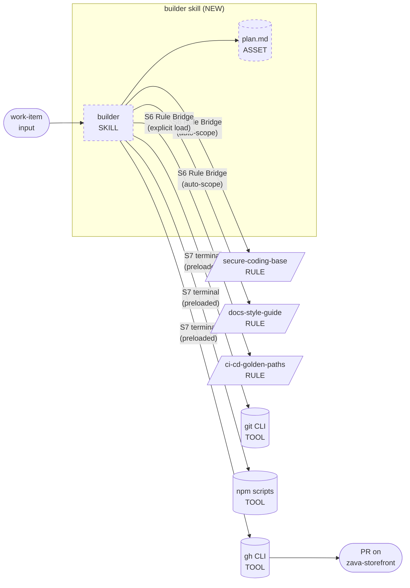
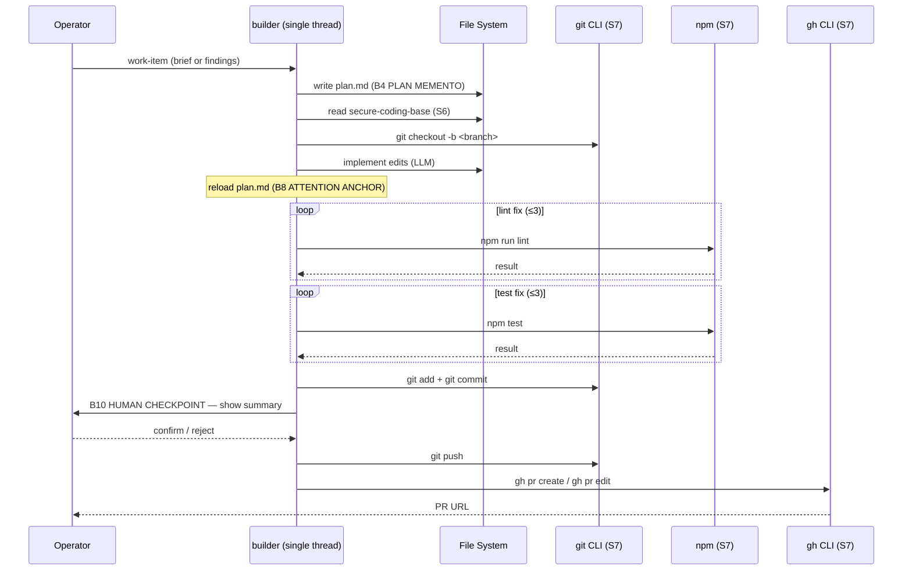
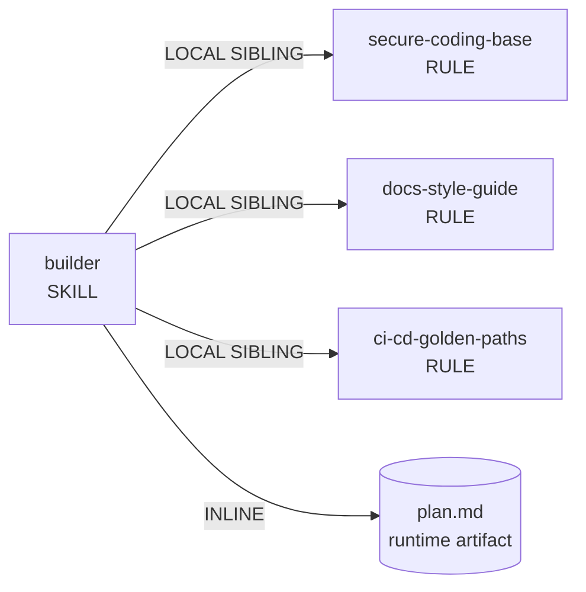

# Genesis handoff packet — `builder` skill

Produced by: genesis (steps 1–6)
Date: 2026-06-22
Status: DESIGN COMPLETE — coder thread takes over at step 7

---

## Step 1 — Intent & scope

**Capability (one paragraph):** The `builder` skill takes a work item — either a short feature brief or a list of review findings to address — and implements the change as commits on a new branch, then opens or updates a pull request on `zava-storefront`. It reads the team's three Zava guideline instruction files (security, architecture, docs) so the code it produces already meets Zava standards. It stays strictly within the work item's stated scope; anything larger it surfaces in the PR description for a human rather than building it. Before opening or updating the PR it runs `npm run lint` and `npm test`; if either check is red it diagnoses and fixes (bounded retries) before proceeding.

**What this skill does NOT do:** architecture review (→ `genesis`), pre-push review (→ `panel-review`), incident postmortems (→ `incident-to-pr`), IaC / infra changes, multi-repo changes, cross-cutting refactors.

**Dispatch description (draft for frontmatter):**
> Use this skill to implement a feature brief or a set of review findings as a branch + pull request on zava-storefront. Trigger when given a work item, ticket, Jira-style description, list of code-review comments to act on, or any request phrased as "implement X", "fix the PR feedback", "apply the reviewer suggestions", "build this feature", "make this change", or "open a PR for". Reads the team's security, architecture, and documentation guidelines so code already meets Zava standards. Stays within stated scope — out-of-scope discoveries are noted in the PR description, not built. Does NOT replace genesis (architecture design) or panel-review (pre-push review).

Character count: 658 — within 1024-char hard cap. ✓

**Cost stance:** `balanced` (default). No cap declared.

---

## Step 2 — Component diagram

**Modules:**
| Module | Type | Status |
|---|---|---|
| `builder` | SKILL | NEW |
| `plan.md` | ASSET (runtime) | NEW |
| `secure-coding-base` | RULE (LOCAL SIBLING) | EXISTING |
| `docs-style-guide` | RULE (LOCAL SIBLING) | EXISTING |
| `ci-cd-golden-paths` | RULE (LOCAL SIBLING) | EXISTING |
| `git CLI` | S7 TOOL (preloaded terminal) | EXISTING in substrate |
| `npm scripts` | S7 TOOL (preloaded terminal) | EXISTING in substrate |
| `gh CLI` | S7 TOOL (preloaded terminal) | EXISTING in substrate |

---

## Step 3 — Thread / sequence diagram

**Pattern selection:**

1. Refactor pass: no existing `builder` to refactor. `incident-to-pr` and `panel-review` have no dispatch collision. R1/R2/R3/R4 do not fire.
2. Tier-3 architectural pattern: **A9 SUPERVISED EXECUTION** — the work names a system of record (repo) and consequential actions (git commit, push, gh pr create). Single-thread; no fan-out (one implementation lens). Matches A9 selection heuristic.
3. Tier-2 patterns within A9: B4 PLAN MEMENTO (plan.md before execution), B8 ATTENTION ANCHOR (reload plan at each stage), S7 DETERMINISTIC TOOL BRIDGE (git/npm/gh), S4 VALIDATION DECORATOR (lint+test gates), B10 HUMAN CHECKPOINT (before push), S6 RULE BRIDGE (three instruction files), B2 CONDITIONAL DISPATCH (feature-brief vs review-findings path), C1 LAZY ASSET (instruction files load at the step that needs them).

**No fan-out.** Rationale: the three guideline files are constraints applied by a single implementation lens, not independent lenses producing parallel verdicts. Fan-out + synthesizer (B1/A1) would be correct if each file produced a competing architectural opinion requiring synthesis; here they compose into a single coding standard the LLM applies in one pass.

---

## Step 3.1 — Tradeoff check

Two shapes considered:

| Slot | Option A | Option B | Decision |
|---|---|---|---|
| Overall topology | A9 SUPERVISED EXECUTION | A2 PIPELINE + S4 between stages | A9 — at least one stage is an irreversible consequential action (push, PR open); A9's heuristic fires |

A2 is not rejected — it is subsumed: the A9 spine IS a pipeline spine with S4 gates between stages. No separate tension.

No further tradeoff matrix needed.

---

## Step 3.2 — Cost check

| Module | Role class | Prefix size | Output volume | Turn count | Cache note |
|---|---|---|---|---|---|
| `builder` skill body | implementer | M (≈ skill body + 3 instruction files ≈ 10–20K tokens) | M–L (code changes + PR description) | medium (5–10 turns) | S6 rule files are stable prefix; B13 applies: place them before variable suffix |

**Workflow-level estimate (balanced stance):**
- S scenario (trivial 1-file fix): 20–40K input, 5–15K output → < $0.30 at token pass-through
- M scenario (3–5 file feature): 40–80K input, 15–40K output → $0.30–$1.20
- L scenario (8+ file feature with fix loops): 80–160K input, 30–80K output → $1.00–$3.00

All within `balanced` stance. No cap declared; no frugal-tier patterns required.

**Cache-aware prefix order:** persona/skill body → instruction files (stable) → plan.md content (reloaded but compact) → variable suffix (file diffs, tool outputs).

---

## Step 3.5 — Composition decision

| Box | Composition mode | Rationale |
|---|---|---|
| `builder` SKILL | INLINE (own directory) | New module; all core logic unique to this capability |
| `plan.md` | INLINE (runtime artifact) | Created per-run; not distributed |
| `secure-coding-base` | LOCAL SIBLING | Same source tree (`.github/instructions/`); scope-attached; one project |
| `docs-style-guide` | LOCAL SIBLING | Same source tree; scope-attached; one project |
| `ci-cd-golden-paths` | LOCAL SIBLING | Same source tree; scope-attached; one project |
| git/npm/gh CLI | Substrate tool surface (S7) | Not modules; preloaded by harness |

**Declaration mechanism for LOCAL SIBLING rule files:** companion-module reference in SKILL.md body with explicit relative file paths (`.github/instructions/<file>.md`). The harness already auto-loads them via scope-attach; the explicit reference serves as ATTENTION ANCHOR so the agent does not skip the grounding step.

**No EXTERNAL MODULEs declared.** None of the rule of three / independent cadence / different owner / pinning-worthy criteria fire for this single-repo setup.

---

## Step 4 — SoC pass

| Existing module | Dispatch description overlap? | Verdict |
|---|---|---|
| `incident-to-pr` | "Turn a Sev-1/Sev-2 incident postmortem…" | No overlap — `builder` does not trigger on postmortems |
| `panel-review` | "Pre-push panel review of staged changes…" | No overlap — `builder` does not review, it implements |
| `genesis` | Architecture design phase | No overlap — `builder` does not design |

R1 SPLIT: description has one trigger noun-phrase ("implement a work item as a branch+PR"). No conjunction. Single responsibility. R1 does NOT fire.

R2 FUSE: No thin sibling with lockstep co-invocation. R2 does NOT fire.

R3 EXTRACT: Instruction files already extracted as LOCAL SIBLINGS. S7 steps are procedure, not extractable content. R3 does NOT fire.

S7 inventory (all cross the tool bridge; preloaded terminal route selected):
- `git checkout -b` — create branch
- `git status --porcelain` — fact-that-must-be-true: working tree clean
- `npm run lint` — verify correctness
- `npm test` — verify correctness
- `git stash / git stash pop` — isolate pre-existing test failures
- `git add / git diff --staged --stat / git commit` — commit side effect
- `git push` — push side effect (irreversible; B10 guards)
- `gh pr create / gh pr edit` — PR open side effect (irreversible; B10 guards)

---

## Step 5 — Compliance check

| Check | Result | Severity |
|---|---|---|
| Single Responsibility | One capability: implement work item as branch+PR | PASS |
| PROSE Progressive Disclosure | Staged process; instruction files load at the step that needs them | PASS |
| PROSE Reduced Scope | Explicitly out-scopes design, review, IaC, multi-repo | PASS |
| PROSE Orchestrated Composition | All side effects cross S7; no hand-rolled hallucination | PASS |
| PROSE Safety Boundaries | B10 HUMAN CHECKPOINT before push; scope cap rule | PASS |
| PROSE Explicit Hierarchy | Nine stages numbered and named | PASS |
| LLM truth #1 (context degrades) | B8 ATTENTION ANCHOR reloads plan at each stage | PASS |
| LLM truth #5 (plan before execution) | B4 PLAN MEMENTO written before any tool call | PASS |
| MODULE ENTRYPOINT: name regex | `builder` — 7 chars, `[a-z0-9]`, no hyphens issues | PASS |
| MODULE ENTRYPOINT: body ≤ 500 lines | Draft is ~240 lines | PASS |
| MODULE ENTRYPOINT: description ≤ 1024 chars | 658 chars | PASS |
| MODULE ENTRYPOINT: description imperative | Starts with "Use this skill to…" | PASS |
| UNGUARDED DESTRUCTIVE TOOL | B10 checkpoint gates `git push` and `gh pr create` | PASS |

**Open findings:**
- MEDIUM: Weak-form A9 only (no CAPABILITY_GATING in harness). Acceptable — operator is in-session; misstep is recoverable via `gh pr close` and `git push --delete`.

No BLOCKERs.

---

## Step 6 — Handoff packet summary

### Interface sketch

**Module: `builder`**
- **Trigger:** DISCOVERY — description match on "implement / build / PR / review findings"
- **Inputs:** work-item text or path; optional `--branch`; optional `--pr-number`
- **Outputs:** pushed branch + opened/updated PR URL; plan.md written to working directory
- **Dependencies (LOCAL SIBLINGS):**
  - `.github/instructions/secure-coding-base.instructions.md`
  - `.github/instructions/docs-style-guide.instructions.md`
  - `.github/instructions/ci-cd-golden-paths.instructions.md`
- **S7 tools (preloaded terminal):** `git`, `npm`, `gh`

### Declared target set
`common-only` — no per-harness syntax required.

### Invocation mode
DISCOVERY (description-driven match). The user does not name the skill; the dispatcher matches.

### External modules required
None.

### Todos for coder thread

- [x] Step 7a: portability check — load `common.md` (done; all affordances in common substrate)
- [ ] Step 7b: draft `SKILL.md` for `builder`
- [ ] Step 8: validate SKILL.md against this packet (name regex, line budget, description char count, S7 steps all wired, B10 present, no per-harness syntax leaked)
- [ ] Step 8: create `evals/evals.json` with 2 content evals + 20 trigger evals

---

## Evals plan

### Content evals (2 minimum)

**Eval 1 — Feature brief → PR**
- Prompt: "Implement a search-as-you-type debounce on the product search field. The current implementation fires a request on every keystroke. Add a 300ms debounce using the existing `search.ts` module."
- Expected output (with skill): branch `feat/search-debounce` created; `lib/search.ts` edited with debounce; `tests/search.test.ts` updated; lint ✓; test ✓; PR opened with correct description template including out-of-scope section.
- Expected output (without skill): agent may or may not branch; no lint/test gate; no PR description template; security rules not applied.

**Eval 2 — Review findings → PR**
- Prompt: "Apply these review findings on PR #42: (1) `cart.ts` addItem — parameterize the DB query, currently using string concatenation. (2) Missing JSDoc on `removeItem`. Fix both."
- Expected output (with skill): branch `fix/review-<date>` created; `lib/cart.ts` query parameterized; JSDoc added; both checks green; PR updated with changes table.
- Expected output (without skill): agent may fix inline but won't branch, run checks, or update the PR systematically.

### Trigger evals (~20 queries, 60/40 train/val)

**Should trigger (8 train + 4 val):**

Train:
1. "Implement the new product-recommendations widget described in this brief."
2. "Build this feature: add a wishlist button to the product card."
3. "Apply the reviewer's feedback on PR #17."
4. "Make these code-review changes and reopen the PR."
5. "Open a PR for adding pagination to the orders endpoint."
6. "Fix the two findings from the security review."
7. "Take this Jira ticket and implement it."
8. "The PR feedback says I need to add input validation to the search route. Do it."

Validation:
9. "Implement the cart checkout and push a PR."
10. "Act on these four review comments."
11. "Create a branch and open a PR for the cart discount feature."
12. "My reviewer asked me to add tests for the orders module — please add them and update the PR."

**Should NOT trigger (8 train + 4 val):**

Train:
1. "Review my staged changes before I push." (→ panel-review)
2. "Design the architecture for the new recommendation engine." (→ genesis)
3. "Turn this postmortem into a PR." (→ incident-to-pr)
4. "Explain how debouncing works in JavaScript." (informational)
5. "What's the difference between `feat` and `fix` commit types?" (informational)
6. "Check if the CI pipeline is green." (observational, no implementation)
7. "How should I structure the new search module?" (→ genesis / advice, not implement)
8. "Deploy the current main branch to staging." (→ CI/CD workflow, out of scope)

Validation:
9. "Write me a unit test for the debounce function." (test-authoring without branch+PR)
10. "Update the README with the new API docs." (documentation-only, ambiguous — NEAR MISS)
11. "Run the linter and tell me what's failing." (observational)
12. "Summarize what changed in this diff." (analytical)

---

## Cost projection (balanced stance)

| Scenario | Input tokens | Output tokens | Est. cost (token pass-through, Sonnet 4.6) |
|---|---|---|---|
| S — trivial 1-file fix | 20–40K | 5–15K | < $0.30 |
| M — 3–5 file feature | 40–80K | 15–40K | $0.30–$1.20 |
| L — 8+ files with fix loops | 80–160K | 30–80K | $1.00–$3.00 |

Cap check: no cap declared. L scenario accepted.

Cost pattern citations: B4 (reduces variable suffix growth), S6 rule bridge (stable prefix, high cache hit ratio), B8 (compact plan reload vs full re-narration).
