# TIER 3 -- Architectural patterns (system topology)

A Tier-3 pattern names the SYSTEM SHAPE of a non-trivial agentic
capability. Each composes several Tier-2 design patterns plus
substrate primitives. They are the AI-native equivalents of classical
architectural patterns (Layered, Pipes-and-Filters, Microservices,
Saga, Event-Driven) -- the macro shapes a Tier-2 pattern alone cannot
express.

When you recognize a Tier-3 shape, name it and inherit its anti-
patterns verbatim. Re-deriving it from raw Tier-2 patterns risks
rediscovering its failure modes the hard way.

---

## Catalogue at a glance

| AI-native name        | Classical analog            | Composes                                     |
|-----------------------|-----------------------------|----------------------------------------------|
| PANEL                 | Microservices + Gateway     | B1 + N x C2 + S4                             |
| PIPELINE              | Pipes-and-Filters           | B2 per stage + B4 + S4 between stages        |
| ORCHESTRATOR-SAGA     | Saga                        | S3 + B4 + S4 gates                           |
| STAFFED PLAN          | Workflow Engine             | B4 + B7 + B2 per todo + C4                   |
| WAVE EXECUTION        | Build Pipeline (CI stages)  | PIPELINE + B3 per wave + S4 between waves    |
| EVENT-DRIVEN          | Event-Driven Architecture   | TRIGGER ORCHESTRATOR + any Tier-2 mix        |
| ADVERSARIAL REVIEW    | Code Review + Red Team      | B1 + N x C2 + S4 + cold-context spawn        |
| ALIGNMENT LOOP        | Iteration with stop-condition | A1 (or A2) + B4 + B9 + B10 + bounded loop  |
| SUPERVISED EXECUTION  | Plan-Execute-Verify (controller) | B4 + S7 + S4 + (optional) B10            |
| GOVERNED OUTER LOOP   | CI/CD + capability-bounded service account | A6 + strong-form A9 + sandbox + audit |
| RECONCILIATION LOOP   | k8s Operator + SRE control loop | B1 per item + B4 state table + B11 + S4 stop-predicate + C2 + C4 + bounded retry |
| GRADIENT WORKFLOW     | Tiered Architecture; workshop model | B12 + B16 + B13 + (A2 or A3 or A1) + B4   |

---

## A1. PANEL (multi-lens deliberation)

CLASSICAL ANALOG: Microservices + API Gateway -- N specialized services
behind one entry point that synthesizes their outputs.

COMPOSES:
- B1 FAN-OUT + SYNTHESIZER (the topology)
- N x C2 PERSONA PRELOAD (one specialized lens per worker)
- S4 VALIDATION DECORATOR at the synthesis step (gates the verdict)
- B4 PLAN MEMENTO (the synthesis output is the plan artifact)

WHEN:
- A decision benefits from >=3 specialized lenses (security, cost,
  UX, architecture, etc.).
- The lenses are independent; no shared state during evaluation.
- The synthesis is itself a decision, not a concatenation.

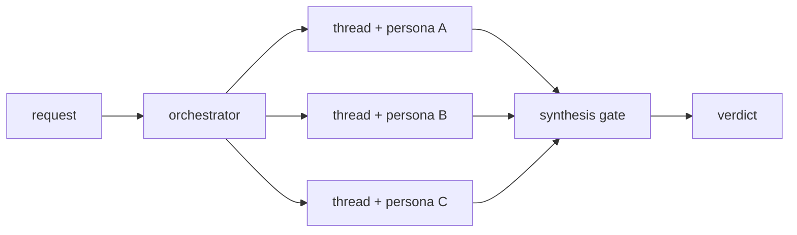

REAL EXAMPLE: the `apm-review-panel` skill in `microsoft/apm`. See
`examples/02-review-panel-architecture.md` for the senior-engineer cautionary
tale of getting this shape wrong.

ANTI-PATTERNS:
- PANEL-WITHOUT-SYNTHESIS -- N lenses, then a concatenation. The user
  reads N reports instead of one decision. The synthesis IS the panel.
- PANEL-IN-ONE-CONTEXT -- running all N lenses sequentially in a
  single window. Each lens contaminates the next; later lenses inherit
  attention drift from earlier ones. The dominant failure mode for
  senior engineers stepping into agent design.
- IMBALANCED PANEL -- N-1 lenses agree, 1 dissents, the synthesis
  follows the majority without examining the dissent. The dissenting
  lens is usually the highest-information signal.

---

## A2. PIPELINE (Pipes-and-Filters)

CLASSICAL ANALOG: Pipes-and-Filters. A linear sequence of independent
filters, each transforming an input into an output for the next.

COMPOSES:
- B2 CONDITIONAL DISPATCH per stage (each stage may pick its
  procedure based on the prior stage's output class)
- B4 PLAN MEMENTO (each stage's output is persisted; the next stage
  reads from the artifact, not from in-context recall)
- S4 VALIDATION DECORATOR between stages (a stage's output is gated
  before the next stage consumes it)

WHEN:
- The work decomposes into ordered stages with verifiable hand-offs.
- Each stage has a different mental mode; mixing them produces noise.
- The PLAN / TASKS / IMPLEMENT decomposition is the canonical case.

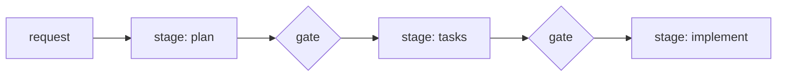

ANTI-PATTERNS:
- STAGE COLLAPSE -- "I will plan as I go". Planning and implementation
  in the same turn. The plan ends up post-hoc and un-falsifiable.
- INFINITE PLANNING -- a plan stage that never gates into tasks.
  `plan.md` grows; tasks never atomize; nothing ships.
- TASKS WITHOUT PLAN -- skipping the plan stage; atomizing directly
  from the request. The dependency graph is wrong; the critical path
  is invisible.

---

## A3. ORCHESTRATOR-SAGA

CLASSICAL ANALOG: Saga -- a long-lived multi-step transaction whose
steps are individually committed and individually compensable, with
an orchestrator coordinating the sequence.

COMPOSES:
- S3 ORCHESTRATOR FACADE (one entrypoint hides the multi-step
  topology from the dispatcher)
- B4 PLAN MEMENTO (every step's outcome is persisted so the saga
  can resume across spawns / sessions / failures)
- S4 VALIDATION DECORATOR at each step (a step that fails triggers
  compensation, not propagation)
- TRIGGER ORCHESTRATOR (substrate) for cross-session continuation

WHEN:
- Work spans more than one trigger event (PR opened, then comment,
  then merge, etc.).
- Steps must be individually durable; partial completion is meaningful
  state.
- Failure at step N requires compensation of steps 1..N-1, not a
  rerun from scratch.

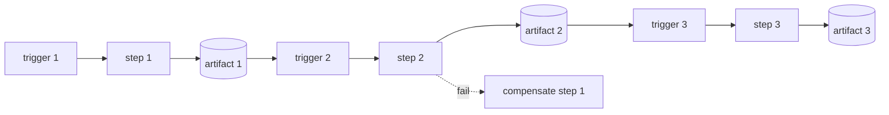

ANTI-PATTERNS:
- ANEMIC SAGA -- a saga whose steps have no compensation logic. On
  partial failure, the system is in an undefined state.
- IMPLICIT TRIGGER COUPLING -- assuming a future trigger will fire
  "soon enough". Without TRIGGER ORCHESTRATOR pinning the cadence,
  the saga stalls invisibly.

---

## A4. STAFFED PLAN

CLASSICAL ANALOG: Workflow Engine with role-bound tasks (a workflow
where each task names the role / capability that must execute it,
and the engine routes to the matching worker).

COMPOSES:
- B4 PLAN MEMENTO (the plan is durable)
- B7 TODO COMMAND (each task is a serialized command with a `staff`
  field naming the persona / skill)
- B2 CONDITIONAL DISPATCH per todo (the executor matches the
  staffing field to a loaded persona / skill)
- C4 DESCRIPTION DISPATCH when a todo's `staff` field names a skill
  the dispatcher must locate

WHEN:
- The plan has tasks that benefit from different lenses or skills
  (one task needs security review, another needs schema design,
  etc.).
- Each task is large enough that loading a specialized persona /
  skill pays for itself in output quality.

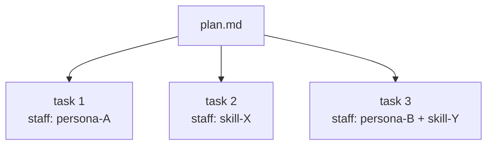

COMPOUNDING GAIN: a task with `staff: skill-X` realizes itself as
a CHILD-THREAD SPAWN that loads skill-X in a fresh context window.
Each task becomes both individually-staffed AND individually-isolated.

ANTI-PATTERNS:
- GOD-PERSONA -- one persona for every task. Defeats specialization;
  every task pays the same lens-loading cost regardless of fit.
- INLINE-PERSONA -- pasting persona content into the plan body
  instead of referencing it. The plan becomes a god module. Use the
  link; let the dispatcher load.

---

## A5. WAVE EXECUTION

CLASSICAL ANALOG: Build Pipeline with stages and gates (CI/CD).

COMPOSES:
- A2 PIPELINE (the spine)
- B3 SUPERVISOR per wave (decides what to spawn next within the wave)
- S4 VALIDATION DECORATOR between waves (a gate that determines
  whether the next wave's assumptions hold)
- B7 TODO COMMAND grouped by wave depth in the DAG

WHEN:
- The plan has a non-trivial task DAG.
- Tasks within a wave are independent; waves have ordering.
- Drift between waves is plausible enough that catching it late is
  expensive.

PROCEDURE:
1. Topologically sort the task DAG.
2. Group tasks at the same depth into a wave.
3. After each wave, run the gate: do the wave's outputs satisfy the
   assumptions the next wave depends on?
4. On gate failure, RE-PLAN FROM THE FAILED WAVE, not from the start.

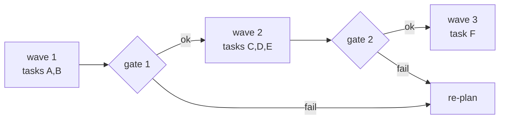

ANTI-PATTERNS:
- WAVE-WITHOUT-GATE -- topologically sorting tasks but not gating
  between waves. Drift compounds silently; failure surfaces at the
  end with no localizable cause.
- EVERY-TASK-IS-A-WAVE -- each task gets its own gate. Gates
  degenerate to noise; the supervisor pays orchestration cost for
  no parallelism win. Combine independent tasks into one wave.

---

## A6. EVENT-DRIVEN

CLASSICAL ANALOG: Event-Driven Architecture -- producers emit events;
handlers react asynchronously; loose coupling between them.

STOP -- DECISION GATE BEFORE LANDING ON A6:
A6 is the GENERAL event-reactive shape. If the request also names
ANY of: `audit`, `auditable`, `compliance`, `sandbox`/`sandboxed`,
`no-token`/`must not hold`, `capability-gating`, `governed`, then
the more specific pattern A10 GOVERNED OUTER LOOP applies and
MUST be co-named (or selected over) A6. A10 inherits A6's event
surface and adds substrate-enforced strong-form A9 + sandboxing
+ audit. Picking A6 alone in this case is an architectural error:
it leaves the substrate guarantees the request explicitly asked
for unrealized. See A10 below.

COMPOSES:
- TRIGGER ORCHESTRATOR (substrate) as the event surface
- Any Tier-2 mix as the handler body
- B4 PLAN MEMENTO when a handler must coordinate with another
  handler that fires later

WHEN:
- Work is reactive: PR opened -> review starts; comment with label
  -> follow-up runs; merge -> deploy fires.
- Handlers are loosely coupled; no handler knows the others by name.
- Cadence is event-driven, not time-driven.

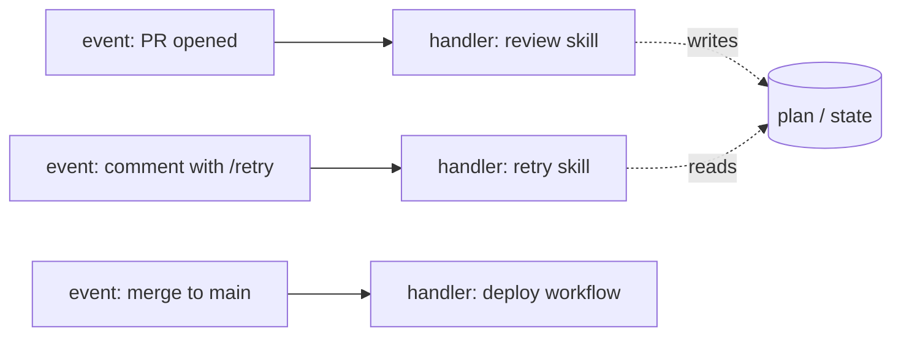

ANTI-PATTERNS:
- IMPLICIT EVENT CHAINS -- a handler that assumes another handler
  fired first. Make the dependency explicit via a persisted artifact
  the second handler reads.
- EVENT FAN-OUT WITHOUT BUDGET -- one event triggering N handlers
  with no rate limit. Budget your concurrency.

---

## A7. ADVERSARIAL REVIEW (red-team + cold-reader gate)

CLASSICAL ANALOG: Code Review combined with Red Teaming. A produced
artifact is read by an INDEPENDENT reviewer whose only goal is to
break it -- find bugs, contradictions, missing cases, drift from goal.

COMPOSES:
- B1 FAN-OUT + SYNTHESIZER (each reviewer is a parallel thread)
- N x C2 PERSONA PRELOAD (specialist lenses + contrarian readers)
- THREAD SPAWN with FRESH CONTEXT (the reviewer must NOT see the
  producer's reasoning trace; only the artifact)
- S4 VALIDATION DECORATOR (the review verdict gates the next step)
- B4 PLAN MEMENTO (the review report becomes a persisted artifact)

WHEN:
- The producing thread has been working long enough that its own
  attention is biased toward "the answer I converged on".
- The artifact is consequential (a plan, a draft, a release call,
  a design doc). Cosmetic review is not enough.
- Cold-traffic conversion matters (a README, a PR description, an
  incident write-up): the producer cannot judge clarity for someone
  who lacks their context.

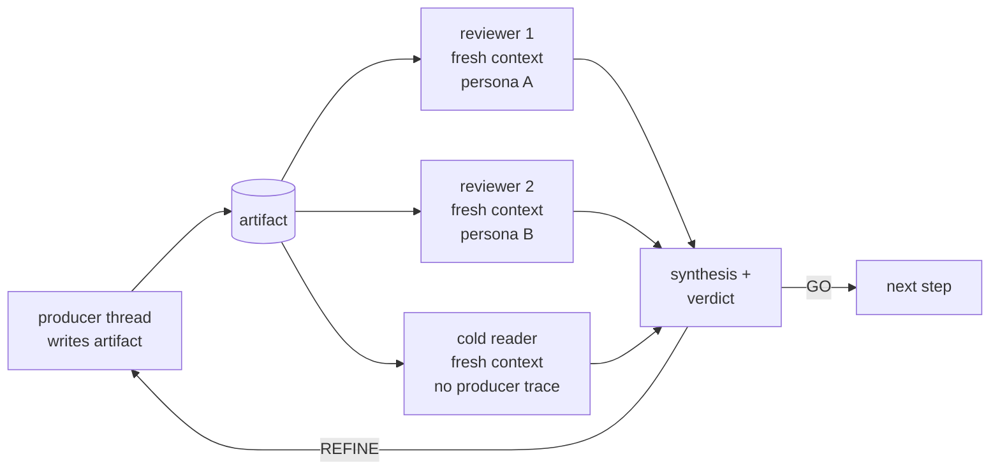

SUB-PATTERN: COLD READER SIMULATION. At least one reviewer is a
non-specialist whose job is to read the artifact with NO producer
context, model the experience of a first-time reader, and report
where the artifact fails to land. Cold readers catch what specialists
ignore: vocabulary inflation, missing onboarding, buried payoff,
self-promotion. For cold-traffic surfaces (README, PR description,
public docs), this sub-pattern is mandatory, not optional.

REAL EXAMPLE: the genesis README iteration loop -- specialist
reviewers (genesis-expert, narrative-arc, funnel) plus four
contrarian developer personas (newcomer, skeptic, power user, OSS
maintainer) reading every draft cold. The cold readers caught
positioning failures that the specialists rated GO. See
`examples/01-readme-iteration.md` for the full walkthrough.

ANTI-PATTERNS:
- COSMETIC DISSENT -- reviewers all rate "GO with minor edits" with
  no dissent. The fan-out shape is decorative; the producer's bias
  passed through unchallenged. A real adversarial review produces
  at least one substantive challenge per round.
- RED TEAM WITHOUT TEETH -- a reviewer is briefed to find issues but
  the synthesis ignores their findings. The role is theatre. A
  GOAL STEWARD (B9) must arbitrate dissent explicitly.
- SINGLE READER -- one reviewer with one lens. By definition not
  adversarial; just a second opinion. Adversarial review needs N
  independent lenses.
- WARM-CONTEXT COLD READER -- the cold reviewer was given the
  producer's reasoning notes "for context". The reviewer is no
  longer cold; they inherit the producer's bias. Ban handoff of
  reasoning traces to cold readers; pass the artifact only.

---

## A8. ALIGNMENT LOOP (bounded iteration with goal steward)

CLASSICAL ANALOG: Bounded iteration with a stop condition + a
goal-validator role. Akin to controller-driven retry loops in
distributed systems, but the stop condition is "goal alignment"
rather than "byte-level convergence".

COMPOSES:
- A1 PANEL or A2 PIPELINE as the round body
- B4 PLAN MEMENTO (the goal + criteria persisted across rounds)
- B9 GOAL STEWARD (the steward arbitrates GO vs REFINE)
- A7 ADVERSARIAL REVIEW inside each round (contrarian readers
  prevent steward rubber-stamping)
- B10 HUMAN CHECKPOINT at the loop's bound (escalation when the
  loop runs out of rounds)
- A bounded round counter (typically 2-3 max)

WHEN:
- The first attempt is unlikely to satisfy the goal in one pass
  (creative work, positioning, complex synthesis).
- Goal drift is a real risk over several rounds.
- The producer cannot self-arbitrate convergence (steward needed).

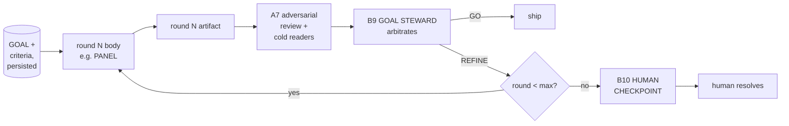

ANTI-PATTERNS:
- UNBOUNDED LOOP -- no max rounds. Burns context and tokens
  indefinitely; never escalates to human. Always cap.
- STALE-CONTEXT REFINEMENT -- reusing the same producer thread
  across rounds, accumulating prior-round noise. Spawn a fresh
  thread per round; pass the goal artifact + the prior-round
  review report only.
- GOAL DRIFT (steward variant) -- the steward edits the goal to
  match emerging output instead of judging output against the goal.
  See B9 MOVING-GOALPOST STEWARD anti-pattern.
- LOOP WITHOUT STEWARD -- iterate without a named goal arbiter.
  Each round produces a different "improvement" with no stable
  target. The loop converges on noise, not goal.

SEE ALSO: A11 RECONCILIATION LOOP. A8 is single-target convergence
(one artifact, N rounds, one steward). A11 is queue-of-targets
convergence (N items, per-item bounded loops, cross-item interlocks,
fold-vs-defer policy). If the work names ONE artifact iterating
toward a goal, stay on A8. If the work names a QUEUE of items each
needing convergence under non-determinism, escalate to A11.

---

## A9. SUPERVISED EXECUTION (plan, deterministic execute, verify)

CLASSICAL ANALOG: Plan-Execute-Verify with a controller; closer to
the Saga executor when the work has irreversible steps; closer to a
Build Orchestrator when steps are repeatable. The defining property
is that EXECUTION crosses out of the LLM layer into deterministic
substrate.

A9 has TWO ENFORCEMENT FORMS. They differ in WHO holds the
capability to externalize.

WEAK FORM (prose-enforced supervision)
The skill body asks the agent to plan, then call a tool, then
verify. The agent HOLDS the write capability throughout; the
discipline is contractual ("you must verify before declaring
done"). Adequate for in-session work where the operator is the
auditor and a misstep is recoverable. Default for inner-loop
agents on a developer laptop.

STRONG FORM (runtime-enforced supervision)
The substrate denies the write capability to the agent. The agent
emits buffered outputs; a deterministic post-stage applies them
under declared filters that the agent cannot bypass. Even a fully
compromised agent cannot externalize beyond what the post-stage
permits. Requires a trigger surface that exposes the substrate
field CAPABILITY_GATING (see `../runtime-affordances/common.md`
TRIGGER ORCHESTRATOR optional fields).

CANONICAL STRONG-FORM REALIZATION: GitHub Agentic Workflows'
SafeOutputs subsystem. The agent never holds a GitHub write token;
its emitted outputs are buffered as artifacts and applied by a
deterministic stage with structural and policy filters. See
`../runtime-affordances/per-trigger-surface/gh-aw.md`.

PREFERENCE RULE: when the trigger surface offers strong-form A9,
USE IT. Weak-form A9 is a fallback for environments without
runtime capability_gating, not a stylistic alternative. A design
that picks weak-form on a strong-form-capable surface (e.g.
"agent calls gh CLI to comment on the PR" inside a gh-aw
workflow) is leaving substrate-level safety on the table; flag
this in review.

COMPOSES:
- B4 PLAN MEMENTO -- plan persists outside the execution thread so
  the verifier can re-read it without inheriting executor state.
- S7 DETERMINISTIC TOOL BRIDGE -- every consequential step runs
  through a typed tool, not LLM-asserted prose.
- S4 VALIDATION DECORATOR -- the verifier step is itself a
  deterministic check (another tool call against the system of
  record), NOT a second LLM pass.
- B10 HUMAN CHECKPOINT (optional but mandatory for irreversible
  effects in the WEAK FORM; STRONG FORM may substitute the
  capability_gating filter for the checkpoint when the externalizer
  guarantees idempotency or reversibility).
- A8 ALIGNMENT LOOP at the wrapping layer when the goal itself is
  not deterministic (e.g. "deploy successfully" with retries on
  recoverable failure).

WHEN:
- The work names a SYSTEM OF RECORD (db, repo, cluster, file
  system, payment processor, queue) and a CONSEQUENTIAL ACTION
  against it.
- Reliability and auditability matter more than expressive
  flexibility.
- The action is irreversible OR triggers downstream effects you
  cannot easily roll back.

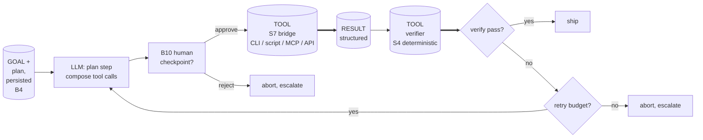

(Double-line `==>` edges denote tool-call results crossing into the
LLM's next inference step; thin edges are LLM-internal control flow.
See `mermaid-conventions.md`.)

ANTI-PATTERNS:
- PLAN-AND-PRAY -- plan is composed; execution is left as LLM
  prose ("now apply the migration ..."). The migration never
  actually runs; the LLM emits a plausible-looking success
  message. Always bridge consequential steps via S7.
- VERIFY-WITH-LLM-ONLY -- after a tool call, the verification step
  asks the LLM "did it work?" and trusts its answer. The LLM
  cannot read present state; verification must be another tool
  call against the system of record.
- UNCHECKPOINTED IRRECOVERABLE -- a destructive tool call (DROP,
  force push, delete bucket, payment) without a B10 HUMAN
  CHECKPOINT or a deterministic precondition gate. The selection
  is still LLM-owned; one fabricated parameter and the action is
  done.
- HARNESS-LLM CONFLATION (architectural variant) -- the design
  describes "the agent runs the migration". Redraw with the bridge
  explicit: the LLM SELECTS the migration; the harness EXECUTES it
  via a deterministic tool; the LLM INTERPRETS the result. Three
  steps, two layers.
- TOOLLESS PRECONDITION -- the design gates the destructive call
  on a fact ("only if branch is main") and reads that fact from
  LLM recall instead of from a tool call. The gate is theatre.
  Bridge the precondition.

SELECTION HEURISTIC: If the design's outcome is "X actually
happened in system Y" (not "we claim X happened"), this is the
shape. Pick A9 over plain A2 PIPELINE when at least one stage is a
consequential side effect; A9 over A8 ALIGNMENT LOOP when the
convergence criterion is a deterministic state, not goal alignment.
When the work is event-triggered AND requires audit + capability
bounding, escalate to A10 GOVERNED OUTER LOOP, which composes
strong-form A9 with TRIGGER ORCHESTRATOR-with-sandbox.

---

## A10. GOVERNED OUTER LOOP

CLASSICAL ANALOG: a CI/CD pipeline backed by a capability-bounded
service account. The job has just enough permission to do the
declared work, the surface that holds the credentials is not the
surface that runs the user's code, and every run leaves a durable
audit trail.

The defining property: an event-triggered, sandboxed, capability-
gated agent run whose externalizations are mediated by a
deterministic post-stage and whose entire trace survives the
session. The agent NEVER holds the write tokens for its declared
externalization targets.

COMPOSES:
- TRIGGER ORCHESTRATOR (substrate primitive #5) WITH the optional
  fields SANDBOXING, CAPABILITY_GATING, and AUDIT_SURFACE all
  populated by the trigger surface. See
  `../runtime-affordances/common.md` and the relevant adapter in
  `../runtime-affordances/per-trigger-surface/`.
- STRONG FORM of A9 SUPERVISED EXECUTION -- because
  CAPABILITY_GATING is the defining substrate field, the
  enforcement form is runtime-enforced by construction.
- A6 EVENT-DRIVEN as the macro topology. A10 is a SPECIALIZATION
  of A6 with three named guarantees added; non-governed
  event-driven work stays at A6.

WHEN:
- Work is reactive to an external event (PR opened, comment with
  label, schedule fires, issue created).
- The agent must externalize state to a system of record (post a
  comment, file a ticket, create a PR, label an issue).
- The operator's threat model includes a compromised or off-task
  agent; the system must not depend on the agent's good behavior
  for the bound on what gets externalized.
- An auditor (security, compliance, manager, future maintainer)
  must be able to reconstruct what fired, what ran, and what was
  written, after the fact.

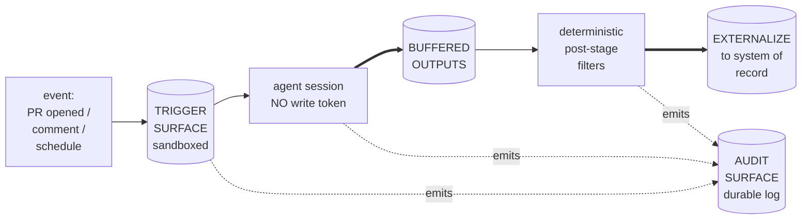

(Double-line `==>` edges denote tool-call results / artifacts
crossing into the next deterministic stage; thin edges are
LLM-internal control flow or audit emission. See
`mermaid-conventions.md`.)

CANONICAL REALIZATION: GitHub Agentic Workflows (gh-aw) on GitHub
Actions runners. The trigger surface IS the substrate that supplies
SANDBOXING (firewall + MCP gateway + per-tool containers),
CAPABILITY_GATING (`safe-outputs:` subsystem), and AUDIT_SURFACE
(Actions logs). The inference harness is independently chosen
(Claude Code OR Codex) per the substrate's harness orthogonality
rule. See `../runtime-affordances/per-trigger-surface/gh-aw.md`.

VENDOR REALITY: A10 is GitHub-specific only in its CHEAPEST
realization. The PATTERN itself is vendor-agnostic; on GitLab CI,
Buildkite, Jenkins, or an internal scheduler, the same shape is
buildable but SANDBOXING and CAPABILITY_GATING must be wired by
hand (network policy + restricted service account + manual
buffer-and-apply post-stage). The architect's job is to NAME the
pattern, then surface the vendor cost in the design's portability
declaration so the operator chooses with eyes open.

ANTI-PATTERNS:
- TOKEN-LAUNDERING -- the workflow grants the agent step a write
  token to the system of record "because the post-stage is too
  fiddly". The capability_gating substrate field is the WHOLE
  POINT of A10; bypassing it reduces the design to A6 EVENT-DRIVEN
  with extra ceremony. If the externalizer truly cannot express
  the desired write, treat that as a missing capability of the
  trigger surface and either extend the post-stage or re-classify
  the work as in-session (A1/A2/A8 inside an interactive harness).
- IMPLICIT-TRUST OUTER LOOP -- no audit surface; "the team will
  notice if it goes wrong". A10's third guarantee is non-optional;
  without AUDIT_SURFACE this is a clandestine bot and operators
  cannot recover from misbehavior they cannot see.
- OVER-BROAD TRIGGERS -- `on: push` (any branch, any path) when
  the work is meaningful only on `main` for `docs/`. Tighten the
  trigger declaration; every event the agent fires on is an event
  it can misbehave on.
- HARNESS-PORTABILITY THEATRE -- the design names A10 but pins
  the inference harness to a single per-harness adapter without
  justification. Substrate's orthogonality rule applies: if the
  work could run under any A10-compatible harness, declare both
  the trigger-surface adapter AND say "common-only" for the
  per-harness axis.
- INNER-LOOP MISCAST AS OUTER -- promoting a single-developer
  laptop task to A10 because "governance sounds good". A10 pays
  in trigger-surface lock-in; cash that cost only when the
  governance properties are needed.
- WEAK-FORM A9 INSIDE A STRONG-FORM SURFACE -- the workflow runs
  on gh-aw but the agent body asks for a `gh` CLI call to comment.
  The agent holds the token; CAPABILITY_GATING is bypassed by
  design. Use `safe-outputs:` instead.

SELECTION HEURISTIC: A10 is the right call when an outcome-framed
operator prompt mentions ALL THREE of (a) an event or schedule
that fires the work, (b) an external write target, and (c) a
constraint on the agent's authority (audit, no-approve, no-merge,
"must not hold token", "must be reviewable"). If only (a) and (b)
are present without (c), A6 EVENT-DRIVEN is sufficient. If only
(a) is present, the work is in-session reactive UI; use A1/A2/A8
inside the inference harness directly.

---

## A11. RECONCILIATION LOOP (queue convergence under non-determinism)

CLASSICAL ANALOG: Kubernetes Operator pattern (CoreOS, Brandon
Philips, "Introducing Operators", 2016) and the SRE control loop
(Beyer / Jones / Petoff / Murphy, _Site Reliability Engineering_,
O'Reilly 2016). Ancestral lineage: cybernetic feedback loop
(Wiener, _Cybernetics_, MIT Press 1948); Shewhart PDCA cycle
(1939). Form-analogue for the discipline-over-substrate framing:
REST (Fielding, dissertation 2000) -- an architectural style
applied over HTTP rather than a feature of HTTP.

A11 is recognition of an ancient style, not invention. The agentic
instance: drive a queue of items each toward a declared terminal
state under non-determinism, level-triggered from a persisted state
table, with per-item bounded loops and cross-item interlocks.

DISCRIMINATOR vs A8 ALIGNMENT LOOP:
- A8 = single-target convergence ("did THIS artifact reach the
  goal?"). One producer thread, N rounds, one steward, one stop-
  predicate.
- A11 = queue-of-targets convergence ("drive N items each to
  terminal state"). Per-item bounded loop, per-item stop-predicate
  read from the system of record, cross-item interlocks (single-
  writer PER ITEM, dedup), and a fold-vs-defer policy at the
  queue level.
- "Iterate on one PR description until reviewers GO" -- A8.
- "For each of N issues, drive to merged PR; some need a Copilot-
  review-address sub-loop; some hit CI red and re-enter" -- A11.
- When both fit (a queue whose items are themselves goal-aligned
  drafts), A11 wraps A8: the per-item sub-agent runs an A8 loop
  on its item.

COMPOSES:
- B1 FAN-OUT + SYNTHESIZER per item (one sub-agent per queue
  entry; fan-in to the state table).
- B4 PLAN MEMENTO -- the ground-truth state table IS the queue
  (item id, current state, next action, attempts, owner). Re-
  derive from the table on every re-entry; never from in-context
  recall.
- B11 FOLD-BY-DEFAULT -- the queue-level policy that recommended
  follow-ups land in this loop, not in a separate one, unless
  they violate the queue invariant.
- S4 VALIDATION DECORATOR -- the per-item stop-predicate is a
  deterministic gate (CI green, review thread resolved, merge-
  ready, schema-valid) read from the system of record, not LLM-
  asserted.
- C2 PERSONA PRELOAD -- each per-item sub-agent loads a focused
  persona; cold context per item.
- C4 DESCRIPTION DISPATCH -- per-item sub-agent boundaries are
  declared at dispatch time so the runner can fan them out.
- A bounded per-item attempt counter (typically 2-4) with B10
  HUMAN CHECKPOINT escalation on exhaustion.

WHEN:
- The work is a queue (>= 2 items) of similar entries each in a
  non-terminal state.
- Each item needs convergence under non-determinism (CI flakes,
  review feedback, race with concurrent edits, partial-failure
  recovery).
- A per-item stop-predicate exists and is readable from the system
  of record (not from prose).
- Cross-item interlocks matter: two sub-agents must not write to
  the same item concurrently; deduplication is per-item.
- The loop is level-triggered: each re-entry re-derives "what
  needs doing" from current state, not from a fixed task list.

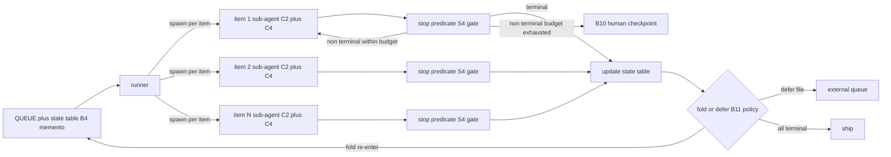

(Per-item edges from SP2 / SPN to budget exhaustion + re-entry
omitted for clarity; same shape as item 1. The interlock IS the
state table: a sub-agent acquires an item by flipping its `owner`
field on spawn and releases it on terminal or escalation. Single-
writer is per ITEM, not per queue -- per-queue serialization is
the wrong grain and collapses the fan-out.)

WORKED EXAMPLE: the `batch-bug-shepherd` skill in `microsoft/apm`
(`.apm/skills/batch-bug-shepherd/SKILL.md`) -- the first concrete
realization we built while developing this pattern, not external
industry validation. It drives a batch of suspected bugs from raw
issue list to mergeable PR queue: per-item triage sub-agent, in-
flight PR sub-agent (which itself drives a review-address + CI-
green sub-loop), no-PR sub-agent (TDD fix session), per-verdict
completion sub-agent. A `plan.md` state table is the canonical
ground truth; every re-entry reloads it. Runs in GitHub Copilot
CLI -- a substrate that exposes neither `/goal` nor `/loop` --
which is what makes the substrate-portability claim testable
rather than aspirational.

SUBSTRATE NOTE: A11 requires three baseline primitives from the
harness, and nothing else:
1. SUB-AGENT DISPATCH -- the runner can spawn a fresh-context
   sub-agent per item.
2. PERSISTENT STATE -- a write surface (file, table, issue body,
   external store) that survives across sub-agent spawns and
   across the runner's own re-entry.
3. COMPLETION SIGNAL -- each sub-agent returns a structured
   verdict the runner can read.
Vendor sugar (Codex `/goal`, Claude Code `/loop` + `/goal`,
Copilot CLI open issues #2129 and #3364) packages the re-entry
contract as a slash command; the discipline does not depend on
the sugar. We tested this by building the worked example above
in Copilot CLI, which has neither. A substrate gap -- e.g. a
streaming-only harness with no completion signal -- degrades the
pattern but does not invalidate it; document the gap in the
design's portability declaration.

ANTI-PATTERNS:
- LOOP WITHOUT STOP-PREDICATE -- the per-item loop terminates on
  token exhaustion, not on a deterministic gate. Maps to ch19
  anti-pattern #14 COST RUNAWAY. The stop-predicate is S4; if you
  cannot name it, you do not have a loop, you have a leak.
- DEFER-BY-DEFAULT -- recommended-follow-up becomes the dumping
  ground; the queue grows faster than it drains. The fold-by-
  default policy (B11) inverts this: the loop absorbs follow-ups
  unless they violate the queue invariant. Maps to ch19 #10 NOT
  FIXING PRIMITIVES.
- DRIFT WITHOUT REASSERTION -- each iteration re-derives "what to
  do" from in-context recall rather than from the persisted state
  table. Edge-triggered intrusion into a level-triggered pattern;
  the loop drifts. Maps to ch19 #17 PERSONA DRIFT.
- MULTI-WRITER PER ITEM -- two sub-agents touch the same PR /
  issue / comment without an interlock. Race condition plus
  duplicate comments. The state-table `owner` field IS the
  interlock; without it, single-writer is wishful thinking.
- QUEUE-LEVEL INTERLOCK -- single-writer per queue (one runner
  thread) is too coarse: it serializes work that should fan out.
  Single-writer per item is the correct grain.
- UNBOUNDED PER-ITEM RETRIES -- per-item attempts have no cap;
  one pathological item burns the queue's budget. Cap retries
  (typical 2-4) and escalate via B10 on exhaustion.
- A8 MISCAST AS A11 -- forcing single-artifact iteration through
  a queue runner. The runner is overhead; use A8 directly.
- A11 MISCAST AS A8 -- collapsing N items into "one big artifact"
  to reuse A8's steward. The cross-item interlock disappears; the
  fold-vs-defer policy has no surface; per-item budgets collapse.

SELECTION HEURISTIC: A11 is the right call when the user intent
contains any of: "queue of items", "for each issue/PR/file",
"drive to terminal state", "until green", "drift correction",
"reconcile", "sweep the backlog". If the intent names ONE
artifact iterating toward a goal, that is A8. If the intent names
N items each needing per-item convergence with cross-item
ordering, that is A11. When the work is also event-triggered
with audit + capability-gating requirements, A10 GOVERNED OUTER
LOOP is the wrapping pattern and A11 may live inside the gated
session as the in-loop discipline.

---

## A12. GRADIENT WORKFLOW (cost-shape topology)

CLASSICAL ANALOG: Tiered Architecture (Fowler, _Patterns of
Enterprise Application Architecture_, Addison-Wesley 2002 --
expensive computation at the top, cheaper presentation at the
edges); the workshop model in industrial production (one master
craftsman, several journeymen, many apprentices).

A12 is the architectural shape that makes B12 MODEL ROUTER and
B16 EFFORT GOVERNOR pay off at scale. Instead of running every
stage of a workflow on the same role class, gradient workflow
declares an explicit COST GRADIENT across stages: heavy at the
front (planning, scoping), middle on the bulk (per-item
execution), light at the back (verification, triage,
reconciliation).

COMPOSES:
- B12 MODEL ROUTER for the per-stage role-class binding.
- B16 EFFORT GOVERNOR for the per-stage effort declaration.
- B13 CACHE-AWARE PREFIX so each stage's prefix is stable across
  its repeated calls (especially the middle and back, which run
  many times).
- One Tier-3 backbone (typically A2 STAFFED PLAN, A3 PIPELINE,
  or A1 PANEL). Gradient workflow is a COST OVERLAY on these,
  not a replacement.
- B4 PLAN MEMENTO between stages (state persists; each stage
  reads from the table, does not assume context from the
  previous stage).

WHEN:
- The work decomposes into stages with clearly different
  capability requirements.
- One or more stages will run MANY times (per-item fan-out,
  per-stage loop). The cost-per-call delta between role classes
  compounds.
- The expensive role class is genuinely needed for ONE stage
  (typically planning or final synthesis) but not the rest.

CANONICAL SHAPE:

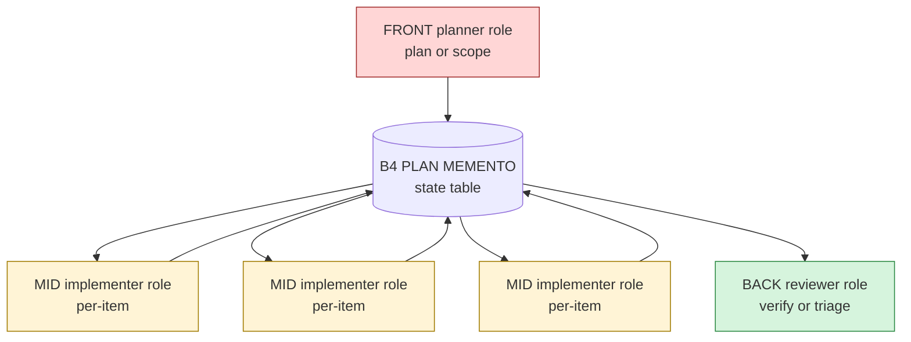

The fan width (number of MID workers) determines the savings
ratio. With 1 planner-call + N implementer-calls + 1 reviewer-
call, switching the N from planner-class to implementer-class
saves roughly (planner_rate - implementer_rate) * N output
budget. Past N=4 the savings dominate the planner cost; below
N=2 the saving is marginal and gradient workflow is overkill.

DISCRIMINATOR vs A2 STAFFED PLAN: STAFFED PLAN names HOW THE
WORK IS STAFFED (one planner thread, N worker threads with
persistent plan). GRADIENT WORKFLOW names WHAT EACH STAFFED
SLOT COSTS. They compose: a STAFFED PLAN that places a planner-
class model on the planning thread and implementer-class on the
worker threads IS a gradient workflow.

DISCRIMINATOR vs A1 PANEL: PANEL names a multi-LENS structure
(different personas). GRADIENT names a multi-COST structure
(different role classes). A panel where every lens is implementer-
class is not a gradient workflow. A panel where one synthesizer
is planner-class and the lenses are implementer-class IS a
gradient workflow.

ANTI-PATTERNS:
- FLAT WORKFLOW with a heavy class on every stage. Common when
  the architect designs "for quality" and never re-examines
  per-stage capability need. Apply R5 COST PRUNE.
- INVERTED GRADIENT -- cheap class up front (planning), heavy
  class on the bulk (execution). The plan misjudges effort and
  the heavy class re-does the planner's work mid-execution.
- BUDGET-DRIVEN PROMOTION -- promoting a back-stage role class
  to implementer-class because "the cheap class missed an edge
  case once". Add S4 VALIDATION DECORATOR instead; do not
  flatten the gradient to mask a missing gate.
- GRADIENT WITHOUT CACHE DISCIPLINE -- the MID stage runs N
  times but its prefix changes per item (no B13). Every call
  pays full input rate; the gradient savings on output are
  partly eaten by uncached input.

---

## How Tier-3 patterns compose with each other

Tier-3 patterns are not mutually exclusive. The canonical senior-
engineer plan combines several:

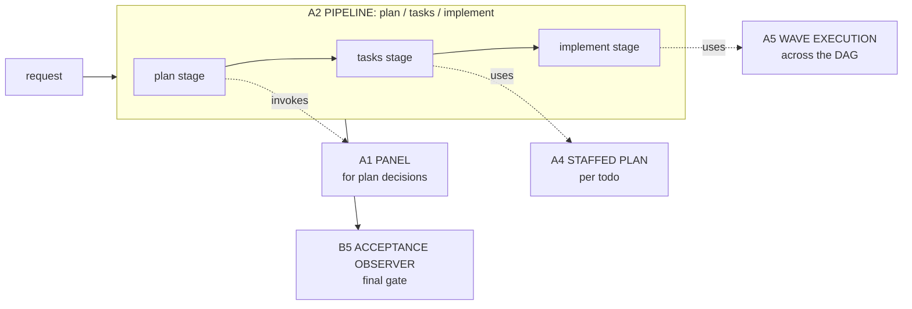

A2 PIPELINE shapes the macro stages. A4 STAFFED PLAN fills task slots
in the tasks stage. A5 WAVE EXECUTION runs the implement stage when
the DAG warrants it. B5 ACCEPTANCE OBSERVER (a Tier-2 behavioral
pattern) closes the work. A1 PANEL plugs into any stage that needs
deliberation rather than single-lens judgement.

A second common composition combines a reconciliation loop with
governance and per-item upgrades:

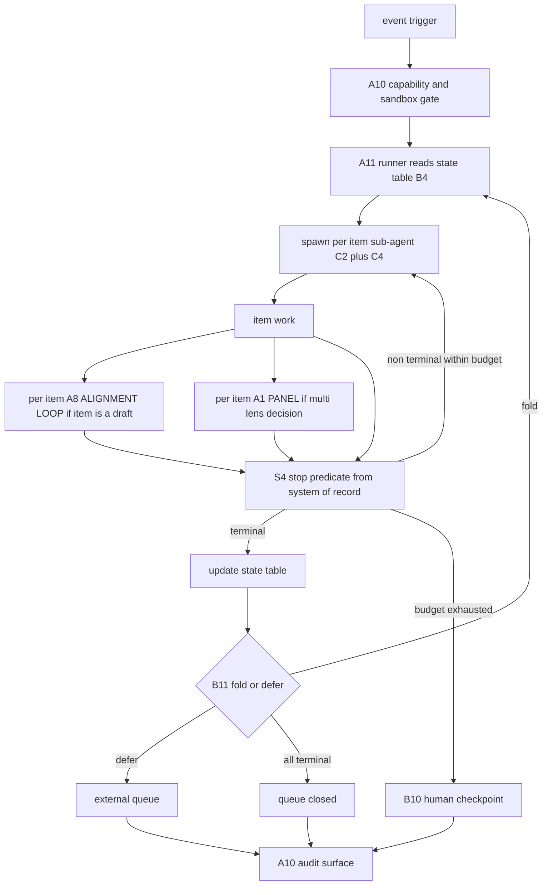

Three independent composition axes are visible here:

- OUTER WRAP (A10): when the queue runner must be event-triggered
  with audit + capability-gated execution, A10 GOVERNED OUTER LOOP
  is the wrapping pattern. A11 lives inside the gated session as
  the in-loop discipline. The production-deployment shape.
- PER-ITEM DROP-IN (A8 or A1): when each queue item is itself a
  creative draft, the per-item sub-agent runs A8 ALIGNMENT LOOP
  rather than ad-hoc iteration. When a per-item decision needs
  multi-lens judgement (architecture call, security trade-off),
  the per-item sub-agent calls A1 PANEL. Per-item upgrades.
- QUEUE POLICY (B11): the fold-vs-defer call lives at the queue
  level, not per item. B11 FOLD-BY-DEFAULT is the policy primitive
  that inverts the recommendation-as-backlog failure mode.

These three axes compose independently. You can have A11 alone
(interactive runner, manual re-entry, no per-item drafts), A10
wrapping A11 alone (governed unattended queue, simple terminal
state per item), or the full nesting above.

---

## Selection heuristic

```
need >=3 specialized lenses with a synthesis decision?
  -> A1 PANEL

work decomposes into ordered stages with verifiable hand-offs?
  -> A2 PIPELINE

work spans multiple trigger events; partial completion meaningful?
  -> A3 ORCHESTRATOR-SAGA

plan exists; tasks benefit from per-task staffing?
  -> A4 STAFFED PLAN

task DAG is non-trivial; drift between waves is expensive?
  -> A5 WAVE EXECUTION

work is reactive to events from outside the agent?
  STOP. First answer YES/NO to this gate:
    Does the request also mention any of: audit / auditable /
    compliance / sandbox / no-token / "must not hold" / capability-
    gating / governed?
    YES -> jump to A10 entry below FIRST. Co-name both if A10 fits.
    NO  -> A6 EVENT-DRIVEN

event-triggered AND must externalize AND agent authority must be
bounded by audit + capability-gating + sandbox?
  -> A10 GOVERNED OUTER LOOP (specialization of A6; mandatory
     when ANY of: capability_gating, audit_surface, or sandboxing
     is named in the request -- not all three required)
  ALSO: A10's canonical strong-form realization is gh-aw on
  GitHub. If the operator's substrate is NOT gh-aw (e.g. GitLab
  CI, Azure Pipelines, Jenkins), the pattern is still A10 but
  the handoff MUST flag the substrate gap explicitly: "A10
  selected; canonical strong-form A9 (substrate-enforced
  capability_gating) not available on <substrate>; degrade to
  weak-form A9 with engineered token isolation and document the
  residual risk." Do not pretend the gap does not exist.

artifact is consequential and producer is biased by long context?
  -> A7 ADVERSARIAL REVIEW (always layer COLD READER for cold-
     traffic surfaces)

work is creative, multi-round, with goal-drift risk?
  -> A8 ALIGNMENT LOOP (bound the rounds; steward + cold readers)
  (if the work is a QUEUE of items each needing convergence, not
   a single artifact iterating, that is A11 below, not A8)

work names a queue of items each needing convergence under non-
determinism; per-item bounded loop; cross-item interlocks (single-
writer per item)?
  -> A11 RECONCILIATION LOOP (fold-by-default; state table as
     ground truth; substrate needs only sub-agent dispatch +
     persistent state + completion signal)

work names a consequential side effect or a fact that must be true
(deploy, migrate, delete, post, compute, verify a system fact)?
  -> A9 SUPERVISED EXECUTION (plan -> deterministic tool -> verify)
  (prefer STRONG FORM when the trigger surface supports it; if
   the request is also event-triggered, you already landed on A10
   above and strong-form A9 is composed inside it)
```

When two patterns fit, prefer the one that gives each thread a
narrower context (fewer competing tokens). When two architectural
patterns fit equally, consult `pattern-tradeoffs.md` and cite the
matrix in your handoff packet.
