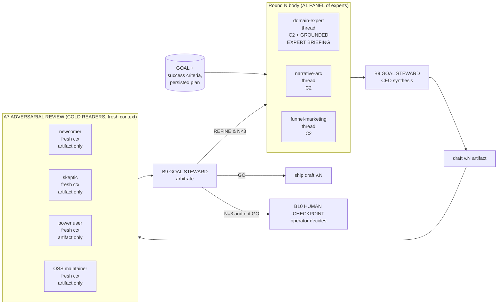

# Worked Example: README iteration to virality (alignment loop)

Load this file when designing any creative, multi-round artifact
work where cold-traffic conversion matters and goal drift is a real
risk. It walks through the genesis README iteration loop -- the
canonical instance of A8 ALIGNMENT LOOP composed with A1 PANEL,
A7 ADVERSARIAL REVIEW (with COLD READER SIMULATION), B9 GOAL
STEWARD, and B10 HUMAN CHECKPOINT.

This is a sister file to `examples/02-review-panel-architecture.md`. That one
covers the multi-lens code review case; this one covers the
multi-round creative iteration case. They use overlapping patterns
but very different stop conditions.

## The starting goal

Reposition a project README from a feature-list framing to a
positioning-thesis framing. Audience: skeptical OSS developers
arriving cold from forums (Hacker News, Reddit, X). Success
criteria:

1. Hero sentence states the thesis unambiguously; readable on first
   pass without prior context.
2. Skeptical reader hits pitch + install path within the first
   viewport.
3. Reader reaches the proof artifact (worked example, demo, or
   architectural diagram) before bouncing.
4. Every section advances at least one of: install, use, get-value,
   star. No decorative section.

## Why a single-thread draft fails

A producer thread that drafts the README, then critiques its own
draft, then redrafts, suffers four documented failure modes from
the durable truths:

- Truth #1 (context is finite). After draft 1, the producer's
  window holds: the original prompt + their reasoning trace + draft
  v1 + their critique notes + draft v2 + ... The earliest framing
  loses attention weight; later drafts inherit drift.
- Truth #3 (output is probabilistic). One thread sees one
  realization of the probability cloud; cold-traffic surfaces need
  multiple lenses to surface a stable signal.
- Truth #4 (hallucination). The producer fills positioning gaps
  with confident-sounding language not grounded in the project
  corpus; without an external grounding step, those claims ship.
- A producer cannot be cold to their own draft. The COLD READER
  sub-pattern is impossible inside the producing thread.

## The architecture (Tier-3 + Tier-2 composition)

The shape is **A8 ALIGNMENT LOOP**. Inside each round body it
realizes **A1 PANEL** for the expert phase and **A7 ADVERSARIAL
REVIEW with COLD READER SIMULATION** for the contrarian phase.
The CEO appears twice as a **B9 GOAL STEWARD** -- once after
experts, once after cold readers -- and the loop terminates either
by GO or by **B10 HUMAN CHECKPOINT** at round 3.

## Step-by-step decisions and tradeoff citations

### Why A1 PANEL for the expert phase (not sequential)

Tradeoff matrix #4 (`pattern-tradeoffs.md`): three independent
lenses, no shared state -> PARALLEL + NO SHARED STATE cell ->
B1 FAN-OUT + SYNTHESIZER, which is the topology of A1 PANEL.

A sequential expert chain (expert 1 reads expert 0's output) would
contaminate later experts with earlier bias and collapse three
lenses into a hybrid one.

### Why A7 ADVERSARIAL REVIEW with cold readers (not just a second pass)

Truth #4 (hallucination is inherent). Truth #1 (context decay).
The producing CEO has been steeped in the goal for the whole
session; their notion of "obvious" no longer maps to the cold
reader's notion of "obvious".

Tradeoff matrix #2 (gate types): the failure mode is "artifact
fails to land for an unprimed reader" -- an EXTERNAL JUDGEMENT
verdict. The corresponding cell is A7 ADVERSARIAL REVIEW with
COLD READER. Internal verdicts (S4, B9 alone) cannot catch this.

Mandatory because the surface is cold-traffic. The COLD READER
SIMULATION sub-pattern is non-optional for any cold-traffic
surface.

### Why B9 GOAL STEWARD (not voting)

Tradeoff matrix #5 (synthesis style): three specialist lenses
optimize for different axes (corpus alignment vs narrative vs
conversion). Voting (CONSENSUS / MAJORITY) suppresses the
highest-information dissent. The matched cell is CEO-ARBITRATED:
a steward persona that holds the goal + criteria and arbitrates
across axes.

The CEO does NOT generate critique themselves; specialists do.
The CEO synthesizes. This is the discriminator vs PANEL-WITHOUT-
SYNTHESIS (a common A1 anti-pattern).

### Why bounded rounds (2-3 max)

Truth #1 again. Each loop round consumes context and tokens; an
unbounded loop converges on noise, not goal (see A8
UNBOUNDED LOOP anti-pattern). Three rounds is empirically the
ceiling at which expert-CEO-cold-reader convergence still
produces material improvement; past that, the human is a better
arbiter than another iteration.

### Why B10 HUMAN CHECKPOINT at round 3 (not "ship best draft")

Truth #4 + the goal's stakes. The README is consequential and
cold-traffic-shaped. If three rounds did not converge, the
agent's self-confidence is no longer reliable; ship-with-caveats
is a false-choice gate (B10 anti-pattern). Hand the decision to
the human with the round-3 dossier (drafts v1..v3, all reviews,
the steward's deltas).

### Why fresh context for cold readers (not producer-context)

A7 anti-pattern: WARM-CONTEXT COLD READER. If the cold reader is
given the CEO's reasoning notes "for context", they are no longer
cold; they inherit the producer's frame and rate it generously.
Each cold-reader thread spawns with: (a) the artifact only, (b)
their persona file, (c) a brief rubric of what to comment on.
NOT the goal text, NOT the prior drafts, NOT the steward's notes.

### Why C2 + GROUNDED EXPERT BRIEFING (not just persona names)

Anti-pattern: NAMED-NOT-GROUNDED EXPERT. A persona declared as
"domain expert in this project" without grounding the persona in
the project corpus produces confident-sounding text with no
factual anchor; the README inherits hallucinated claims about
the project itself.

The domain-expert persona file points at: SKILL.md, all
`assets/*.md`, `agents/*.agent.md`, prior README drafts. The
briefing handoff cites which artifacts the expert reads BEFORE
critique. The other two experts (narrative, funnel) ground in
external corpora -- see C6 below.

### Why C6 EXTERNAL CORPUS GROUNDING (with bounded scope) for the meta-pass

Truth #5 (pretraining is frozen and cutoff-dated). The narrative-
arc and funnel-marketing experts cite established frameworks
(Hacker News reading patterns, OSS conversion benchmarks). Those
frameworks evolve; the LLM substrate cannot hold them reliably.

The meta-pass declares: "the external corpus is authoritative for
README structural patterns and conversion benchmarks. It is NOT
authoritative for this project's positioning, scope, or
ontology." Without that bounded scope statement, AUTHORITY
OVERREACH ships: the corpus's framing displaces the project's.

## Anti-patterns this design explicitly avoids

- PANEL-IN-ONE-CONTEXT (A1) -- experts run in parallel fresh
  contexts, never sequentially in one window.
- WARM-CONTEXT COLD READER (A7) -- cold readers see the artifact
  only, not the producer trace.
- COSMETIC DISSENT (A7) -- contrarian personas are explicitly
  briefed to find issues, with an output schema requiring at
  least one substantive challenge or escalation.
- MOVING-GOALPOST STEWARD (B9) -- the goal + success criteria are
  persisted as a B4 PLAN MEMENTO and re-injected at each
  steward arbitration; the steward judges output against goal,
  not the other way around.
- UNBOUNDED LOOP (A8) -- max-rounds=3 is a literal terminating
  condition; no judgement-based "one more round if needed".
- SILENT DRIFT (B10) -- when the steward suspects misalignment
  past round 3, the procedure halts and emits the
  human-checkpoint prompt; powering through is banned.
- AUTHORITY OVERREACH (C6) -- the bounded-scope statement on the
  external corpus prevents importing its framing into ontology.

## When to apply this template

- Any creative artifact with cold-traffic conversion stakes:
  README, landing page copy, PR description, announcement post.
- Any multi-round critique where the producer has accumulated
  long context and cannot be cold to their own draft.
- Any decision the producing thread cannot self-arbitrate (goal
  drift detection; tie between near-equal options; suspected
  positioning inflation).

## When NOT to apply this template

- Single-pass code generation. Use the A2 PIPELINE +
  S4 VALIDATION DECORATOR shape from `examples/02-review-
  panel.md` instead.
- Information retrieval ("what does this code do?"). One thread,
  one persona is sufficient; this template is overkill.
- Any task where the goal itself is undefined; the GOAL STEWARD
  has nothing to arbitrate against. Define the goal + success
  criteria first; THEN apply this template.

## Cross-references

- A1 PANEL, A7 ADVERSARIAL REVIEW, A8 ALIGNMENT LOOP
  (`architectural-patterns.md`)
- B9 GOAL STEWARD, B10 HUMAN CHECKPOINT, C2 PERSONA PRELOAD with
  GROUNDED EXPERT BRIEFING, C6 EXTERNAL CORPUS GROUNDING
  (`design-patterns.md`)
- Tradeoff matrices #2, #4, #5 (`pattern-tradeoffs.md`)
- Sister case `examples/02-review-panel-architecture.md` for the
  code-review variant of multi-lens deliberation.
