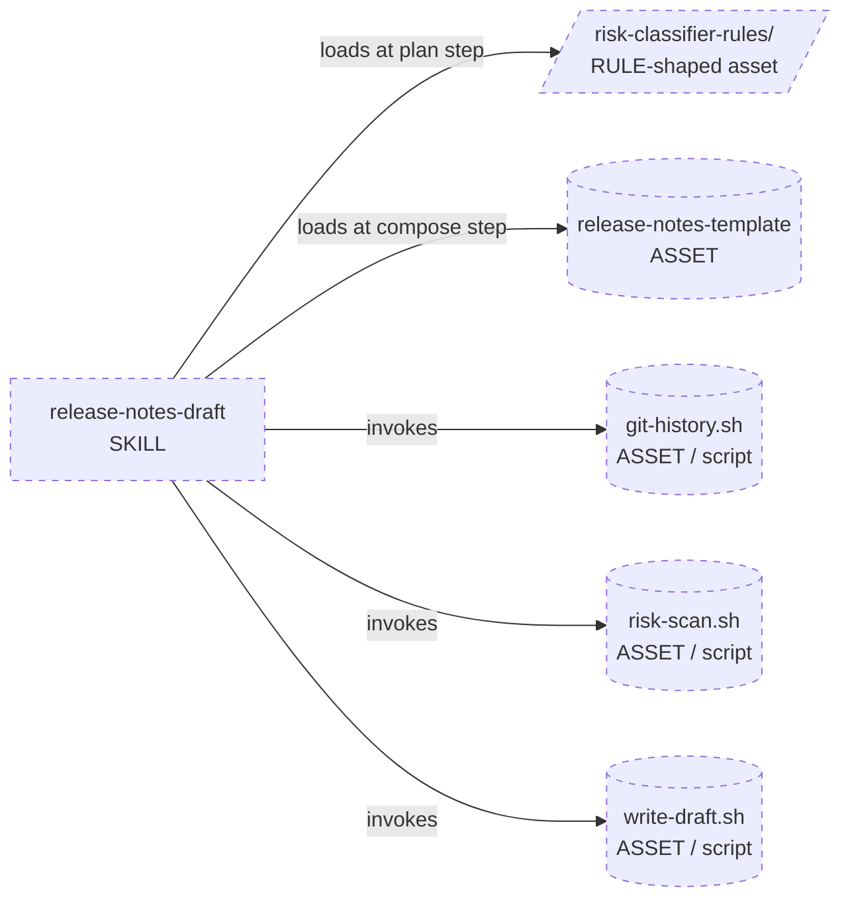
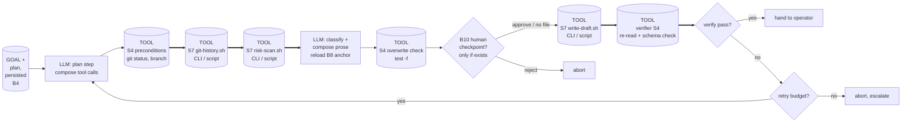
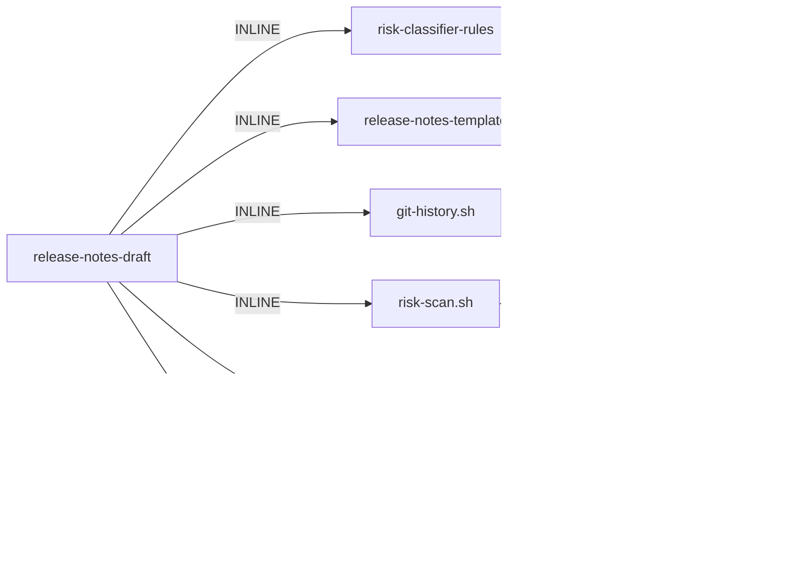

# Cold-load run: release notes from CHANGELOG

> **Operator prompt (verbatim):**
>
> "Draft release notes from CHANGELOG entries for the next version of an open-source library. The library follows Keep-a-Changelog and SemVer; the release notes should land as a GitHub Release on tag push."
>
> **Regime:** single-skill
> **Key pattern decisions:** A9 SUPERVISED EXECUTION + S7 BRIDGE + S4 SCHEMA GATE. A1 PANEL considered and rejected (lens-count gate did not fire).
>
> Output below is the verbatim response of a fresh agent session that
> loaded only `SKILL.md` and the prompt above. No prior context. No
> human cleanup. Execution stopped at the step-6 handoff packet per
> the skill's hard rule.

---

I've cold-loaded the genesis skill (SKILL.md + primitives.md + design-patterns.md + architectural-patterns.md + refactor-patterns.md + composition-substrate.md + pattern-tradeoffs.md + mermaid-conventions.md). Executing the 8-step process now; per the skill's hard rule, I stop at the step-6 handoff packet.

---

# genesis run: release-notes-draft skill

## Step 1 -- Intent + scope

**Capability (one paragraph).** When the operator is about to cut a release, this skill reads the git history since the last tag, classifies each commit into FEATURES / FIXES / BREAKING CHANGES, flags any commit that touches risk-sensitive surfaces (auth code paths, database migrations, or net code removal), and writes a single human-editable artifact `RELEASE_NOTES_DRAFT.md` to the repository root. The operator then edits, decides, and tags. The skill DOES NOT tag the release, push refs, publish to a registry, or open a PR; the draft is the only side effect.

**SRP check.** No "and" connecting two distinct capabilities -- collect/classify/flag/write are sub-steps of the single capability "produce a reviewable release-notes draft". Single design.

**Dispatch description (drafted; <= 1024 chars; imperative; intent-first; pushy on indirect triggers).**

> Use this skill when the user is preparing to cut a release and needs a reviewable draft of what shipped. It reads git commits since the last tag, groups them into features / fixes / breaking changes, flags commits that look risky (touch auth code, database migrations, or remove code), and writes RELEASE_NOTES_DRAFT.md so the user can edit before tagging. Activate on phrases like "cut a release", "prepare release notes", "draft release notes", "what's in this release", "changelog for the next version", "tag and ship", "release prep", "review changes since the last tag", or any moment the user is about to bump a version, push a tag, or publish -- even if they do not say "release notes" verbatim. Does NOT tag, push, or publish; produces a draft file only.

(~830 chars; under the 1024 cap.)

**Invocation mode.** BOTH (operator may forcibly invoke; dispatcher may match indirect triggers like "what's shipping" or "tag and ship").

---

## Step 2 -- Component diagram

Loaded: `assets/primitives.md`, `assets/design-patterns.md`, `assets/architectural-patterns.md`, `assets/refactor-patterns.md`, `assets/mermaid-conventions.md`.

Refactor pre-pass (R1/R2/R3/R4): no existing module graph in scope (greenfield skill). No R-trigger fires. Proceed.



All modules NEW. Marker legend per `mermaid-conventions.md`:

- `S` = MODULE ENTRYPOINT (SKILL).
- `RR` = RULE-shaped asset (a glob-list defining what counts as risky; SCOPE-ATTACHED RULE FILE primitive type, but bundled as an inline asset here -- see step 3.5).
- `T`, `GS`, `RS`, `WS` = ASSETs (template + scripts).

---

## Step 3 -- Thread / sequence diagram + pattern selection

**Pattern selection in tier order:**

1. **Refactor pass:** clean (no existing graph).
2. **Tier-3 architectural pattern:** the design names CONSEQUENTIAL SIDE EFFECT (write `RELEASE_NOTES_DRAFT.md`) and several FACTS THAT MUST BE TRUE (last tag, commit list, file lists per commit, working-tree state). Per the architectural-pattern Selection Heuristic in `architectural-patterns.md` ("work names a consequential side effect or a fact that must be true ... -> A9 SUPERVISED EXECUTION"), the shape is **A9 SUPERVISED EXECUTION**.
3. **Tier-2 decomposition:** A9 composes B4 + S7 + S4 + (optional) B10. Add B8 ATTENTION ANCHOR (mandatory on any non-trivial work per step 3 heuristic), C1 LAZY ASSET for the rules/template/scripts (PROSE Progressive Disclosure), and B6 PROMPT TEMPLATE for the output shape (B6 is the GoF Template Method analogue for the structured RELEASE_NOTES_DRAFT.md skeleton).
4. **Tier-1 idioms:** deferred to step 7b (codegen).

**Lens count:** 1 lens (release-notes drafter). No fan-out trigger (the rule ">=3 independent lenses" does not fit). Single-thread sequential with tool bridges is correct.

**Sequence diagram (thread-level, with tool-call crossings):**

```mermaid
sequenceDiagram
    participant Op as Operator
    participant Th as Thread (release-notes-draft skill loaded)
    participant Sh as Terminal (S7 / preloaded route)
    participant FS as File System (system of record)
    participant Git as Git repo (system of record)

    Op->>Th: trigger ("draft release notes")
    Note over Th: load skill body; persist plan (B4); inject GOAL+constraints (B8)
    Th->>Sh: precondition tool calls (S4)
    Sh->>Git: git status --porcelain ; git rev-parse --abbrev-ref HEAD
    Git-->>Sh: state
    Sh-->>Th: result (clean/dirty; branch)
    Th->>Sh: git-history.sh (GS)
    Sh->>Git: git describe --tags --abbrev=0 ; git log LAST..HEAD --pretty=...
    Git-->>Sh: structured commit list (JSON on stdout)
    Sh-->>Th: commit list
    Th->>Sh: risk-scan.sh (RS) over commit list + RR rules
    Sh->>Git: git show --stat / git diff-tree per commit
    Git-->>Sh: per-commit file deltas
    Sh-->>Th: structured risk findings (JSON)
    Note over Th: LLM-owned step: classify commits into features/fixes/breaking; compose prose; reload anchor (B8)
    Th->>Sh: precondition (S4): test -f RELEASE_NOTES_DRAFT.md (overwrite gate)
    Sh-->>Th: exists / not exists
    alt file exists
      Th->>Op: B10 HUMAN CHECKPOINT (overwrite? abort/rename?)
      Op-->>Th: decision
    end
    Th->>Sh: write-draft.sh (WS) -- emits file
    Sh->>FS: write RELEASE_NOTES_DRAFT.md
    FS-->>Sh: ok
    Sh-->>Th: write result
    Th->>Sh: verifier (S4): re-read file; jq/grep schema check
    Sh-->>Th: verify pass/fail
    Note over Th: synthesize summary; one-writer interlock on RELEASE_NOTES_DRAFT.md
    Th-->>Op: "draft written; N commits; M risk flags; review and tag"
```

**A9-supervised view (lifted from `mermaid-conventions.md` tool-call convention; double-line `==>` denotes tool result crossing back into LLM):**



---

## Step 3.1 -- Tradeoff check

Two slots had alternatives in tension; loaded `assets/pattern-tradeoffs.md`.

**Tension 1: A9 SUPERVISED EXECUTION vs A2 PIPELINE.** Both could shape a "collect -> classify -> flag -> emit" sequence. Cut by **matrix #9 Execution doctrine**, row 1 (`SIDE EFFECT against a system of record -> Tool-delegated`) and row 2 (`FACT THAT MUST BE TRUE -> Tool-delegated`). The design's terminal step is a file write to a system of record (FS), and every input is a fact about another system of record (git). A2 PIPELINE describes ordered LLM stages; it does not name the LLM/CPU boundary. A9 does. **Pick A9.**

```
%% tradeoff: matrix #9 Execution doctrine -> rows 1 + 2 (side effect + fact-must-be-true) -> A9 over A2
```

**Tension 2: where does risk classification run -- LLM-asserted prose or tool-delegated path matching?** Risk = "files matching glob `**/auth/**`, `**/migrations/**`, or commits with net-negative line counts". This is path globbing + arithmetic, both deterministic. Cut by **matrix #9 Execution doctrine** row 2 again (`FACT THAT MUST BE TRUE -> Tool-delegated`) and row 3 (`COMPOSITION, JUDGEMENT, LANGUAGE -> LLM-asserted`). Split:

- Detection of which-files-match-which-rule -> tool (`risk-scan.sh` over a structured rule list).
- Human-readable rationale prose per flagged commit (e.g. "this commit removes 200 lines from `src/auth/session.py` -- verify session-rotation behavior") -> LLM-asserted, fed by the tool's structured output.

```
%% tradeoff: matrix #9 Execution doctrine -> row 2 (fact) for detection; row 3 (composition) for rationale
```

**Tension 3: B10 HUMAN CHECKPOINT -- required or optional?** The terminal write is RECOVERABLE (a draft file the operator immediately edits; not an irreversible release tag). Per A9 anti-pattern UNCHECKPOINTED IRRECOVERABLE, B10 is mandatory only for irreversible effects. **Cut by matrix #2 Gate types**, EXTERNAL x JUDGEMENT cell: B10 is reserved for "hard handover for irrecoverable steps". The recoverable side here is the file write itself; the genuinely-irrecoverable case is **silent overwrite of an existing draft the operator is mid-editing**. So scope B10 narrowly: only fires when `RELEASE_NOTES_DRAFT.md` already exists (the overwrite would destroy work).

```
%% tradeoff: matrix #2 Gate types -> EXTERNAL/JUDGEMENT cell scopes B10 to overwrite-of-existing-draft only
```

---

## Step 3.5 -- Composition decision + dependency graph

Loaded `assets/composition-substrate.md`. Per-box decision:

| Box | Composition mode | Rationale |
|---|---|---|
| `release-notes-draft` (SKILL) | INLINE (it IS the module) | the module under design |
| `risk-classifier-rules` (RULE-shaped asset) | INLINE asset | first project; rule-of-three not satisfied; no independent release cadence yet |
| `release-notes-template` (ASSET) | INLINE asset | content unique to this skill's output shape |
| `git-history.sh` (script) | INLINE asset under `scripts/` | bundled per agentskills.io scripts convention; called by relative path |
| `risk-scan.sh` (script) | INLINE asset under `scripts/` | same |
| `write-draft.sh` (script) | INLINE asset under `scripts/` | same |

**No EXTERNAL MODULE declared.** This is the substantive output of step 3.5: every box is INLINE or LOCAL to the skill bundle. Therefore:

- "external modules required" list at step 6: **EMPTY**.
- DECLARATION MECHANISM per external module: **N/A** (no externals).
- PHANTOM DEPENDENCY risk at step 6 / step 8: **none from external modules** (the failure mode is structurally absent). Recorded explicitly per W6.3.

Rule of three not satisfied today; the rules / template / scripts could promote to a shared module later if a second project needs the same release-drafting shape (R3 EXTRACT trigger to re-evaluate at that point).

**Dependency graph (step 3.5, flowchart LR):**



---

## Step 4 -- SoC pass (incl. W6 / W6.2)

Walked each box against the SoC checklist in SKILL.md step 4.

- **Existing-module duplication?** No comparable existing module assumed in scope; no overlap.
- **Sibling overlap?** Only one module; N/A.
- **Dispatch collision?** Description trigger nouns ("release notes", "draft release notes", "since last tag", "tag and ship") are not generic -- collision with a generic skill is unlikely. Recheck at step 8 against the operator's installed catalogue.
- **R1 SPLIT triggers?** None fire -- single description, no conjunction, no multi-lens body, body fits budget, single change cadence.
- **R2 FUSE / R3 EXTRACT / R4 INLINE?** None -- single new module.
- **PREMATURE SPLIT?** N/A.

### W6 -- CONSEQUENTIAL SIDE EFFECTS (must cross S7)

| # | Side effect | Substrate | S7 route | Gate(s) |
|---|---|---|---|---|
| 1 | Write `RELEASE_NOTES_DRAFT.md` to repo root | file system | preloaded terminal (write via script `write-draft.sh`) | S4 precondition (overwrite check) + B10 IF file already exists |

Single side effect. Crossing S7 explicitly. Anti-pattern HAND-ROLLED HALLUCINATION ("LLM emits the file content as text without invoking write") is structurally avoided: the LLM produces the markdown body as a parameter passed to `write-draft.sh`, which performs the actual `os.write`/`>` operation.

### W6.2 -- FACTS THAT MUST BE TRUE (must cross S7)

| # | Fact | Substrate | S7 route | Anti-pattern guarded |
|---|---|---|---|---|
| 1 | Current branch | git CLI | preloaded terminal: `git rev-parse --abbrev-ref HEAD` | TOOLLESS ASSERTION |
| 2 | Working tree clean / dirty | git CLI | `git status --porcelain` | TOOLLESS ASSERTION |
| 3 | Most recent tag | git CLI | `git describe --tags --abbrev=0` | STALE-CORPUS RELIANCE / recall |
| 4 | Commit list since last tag (sha, subject, body, author, date) | git CLI | `git log LAST..HEAD --pretty=format:%H%x09%an%x09%ad%x09%s` (in `git-history.sh`, structured stdout) | HAND-ROLLED HALLUCINATION |
| 5 | Files changed per commit | git CLI | `git show --stat` / `git diff-tree --no-commit-id --name-only -r SHA` (in `risk-scan.sh`) | TOOLLESS ASSERTION |
| 6 | Net lines added/removed per commit | git CLI | `git show --shortstat` (in `risk-scan.sh`) | TOOLLESS ASSERTION |
| 7 | Whether a commit's file set matches the risk globs | jq/grep against rule list | script-local computation | LLM-asserted classification |
| 8 | `RELEASE_NOTES_DRAFT.md` exists at write time | file system | `test -f RELEASE_NOTES_DRAFT.md` | TOOLLESS PRECONDITION |
| 9 | Post-write file matches expected schema (has H1, has FEATURES/FIXES/BREAKING headings) | jq/grep over emitted file | verifier tool call | VERIFY-WITH-LLM-ONLY |

Every fact and side effect names its substrate and route. None left as LLM-asserted prose.

S7 EXTENSION PATH chosen: **route 1 (preloaded terminal) for all reads**, **route 2 (custom script) for the three bundled `scripts/`** because the operations have stable contracts worth naming and the structured-stdout discipline (JSON out, diagnostics on stderr, `--help`) is best authored in scripts rather than re-derived in skill prose every call. Route 3 (MCP) is overkill -- single-skill use, no cross-harness type-schema benefit yet.

---

## Step 5 -- Compliance check

**Classic principles + PROSE + LLM truths:**

| Axis | Status | Note |
|---|---|---|
| SRP | OK | one capability, one description |
| SoC (LLM/CPU boundary) | OK | facts + side effects all cross S7 (W6 / W6.2) |
| Progressive Disclosure | OK | template + rules + scripts loaded only when their step runs (C1) |
| Reduced Scope | OK | one thread, one persona-equivalent lens |
| Orchestrated Composition | OK | A9 SUPERVISED EXECUTION shape is explicit |
| Safety Boundaries | OK | S4 precondition (overwrite, dirty-tree warning) + bounded B10 |
| Explicit Hierarchy | OK | SKILL.md body links to `references/` and `scripts/` with explicit load triggers |
| Truth #1 (context finite) | OK | B4 + B8 |
| Truth #2 (context explicit) | OK | every fact tool-delegated; no PHANTOM DEPENDENCY (no externals) |
| Truth #3 (output probabilistic) | OK | S7 + S4 |
| Truth #4 (hallucination inherent) | OK | classification is LLM but factual basis is tool-supplied |
| Truth #5 (frozen pretraining) | N/A | no live external corpus |
| MODULE ENTRYPOINT spec -- `name` regex + parent-dir match | DEFERRED TO STEP 8 | proposed name `release-notes-draft` (1-64 chars, `[a-z0-9-]`, no hyphen edge cases) -- must equal parent directory at codegen |
| MODULE ENTRYPOINT spec -- body <= 500 lines AND <= 5000 tokens | DEFERRED TO STEP 8 | budget honored by design (procedure-style body + lazy assets) |
| MODULE ENTRYPOINT spec -- description <= 1024 chars, imperative, intent-first, indirect-triggers named | OK at draft | re-validate emitted frontmatter at step 8 |
| ASCII-only output | OK | enforced |

**Open findings:** none at BLOCKER or HIGH. Two MEDIUMs:

- M1 (MEDIUM): script-side risk rules are inline today; if a second project adopts this skill, R3 EXTRACT to a shared rule module (with explicit dependency declaration to avoid PHANTOM DEPENDENCY) becomes the right move. Note in todos.
- M2 (MEDIUM): the LLM-composed rationale prose for risky commits is not deterministic; if downstream tooling expects a stable shape, add B6 PROMPT TEMPLATE constraint with an output-schema gate (S4) over the rationale block too. Track for v2.

No BLOCKER. Proceed to step 6.

---

## Step 6 -- Handoff packet (PERSIST THIS)

> **DESIGN ENDS AT THE END OF THIS PACKET.** Per truth #5 + substrate concept 6, this packet must be written to the runtime's plan store before step 7b begins. If unsure of harness slot, write to `plan.md` in the session working area.

### 6.1 Diagrams

The component diagram (step 2), the sequence + A9-supervised diagrams (step 3), and the dependency graph (step 3.5) above are part of the packet.

### 6.2 Interface sketch -- per module

**release-notes-draft** (MODULE ENTRYPOINT / SKILL)
- Trigger description: see step 1, drafted (~830 chars).
- Inputs: implicit (current git repo cwd) + optional operator hints ("since v1.2.0" override).
- Outputs: `RELEASE_NOTES_DRAFT.md` at repo root + a stdout summary line ("N commits; M risk flags").
- Dependencies: `./assets/risk-classifier-rules` (asset), `./assets/release-notes-template` (asset), `./scripts/git-history.sh`, `./scripts/risk-scan.sh`, `./scripts/write-draft.sh`.
- Invocation mode: BOTH.

**risk-classifier-rules** (inline RULE-shaped asset)
- Trigger description: N/A (asset, not a skill).
- Inputs: list of commit objects.
- Outputs: structured rule definition (globs for auth, migration paths; threshold for "removes code"). Consumed by `risk-scan.sh`.
- Dependencies: none.

**release-notes-template** (inline ASSET)
- Inputs: classified commit groups + risk findings.
- Outputs: rendered markdown (B6 PROMPT TEMPLATE skeleton with FEATURES / FIXES / BREAKING / RISKS sections).
- Dependencies: none.

**git-history.sh** (inline SCRIPT under `scripts/`)
- Contract: `git-history.sh [--since-tag <tag>]`. Stdout: JSON array of `{sha, author, date, subject, body}`. Stderr: diagnostics. Non-interactive. `--help` documented.
- Dependencies: `git` CLI installed in PATH.

**risk-scan.sh** (inline SCRIPT under `scripts/`)
- Contract: `risk-scan.sh --commits <file.json> --rules <file.yml>`. Stdout: JSON array of `{sha, matched_rules: [...], net_lines: int}`. Stderr: diagnostics. Non-interactive. `--help` documented.
- Dependencies: `git`, `jq`.

**write-draft.sh** (inline SCRIPT under `scripts/`)
- Contract: `write-draft.sh --content <file.md> --target RELEASE_NOTES_DRAFT.md [--force]`. Refuses to overwrite without `--force`. Exit code: 0 ok / 2 exists-no-force / 1 other error. Non-interactive. `--help` documented.
- Dependencies: POSIX shell.

### 6.3 Module composition table

| Box | Mode | Why |
|---|---|---|
| release-notes-draft | self | the module |
| risk-classifier-rules | INLINE asset | unique to this skill; rule-of-three not met |
| release-notes-template | INLINE asset | unique output shape |
| git-history.sh | INLINE script (`scripts/`) | callable contract; not yet shared |
| risk-scan.sh | INLINE script (`scripts/`) | callable contract; not yet shared |
| write-draft.sh | INLINE script (`scripts/`) | callable contract; not yet shared |

### 6.4 External modules required

**EMPTY LIST.** No external module dependency. DECLARATION MECHANISM per external module: **N/A**. PHANTOM DEPENDENCY check at step 8: structurally absent (no externals to ship undeclared).

### 6.5 Declared target set

**`common-only`.** All required runtime affordances are in the common substrate: file read/write, preloaded terminal (universal), and a working `git` binary on PATH (an environmental, not harness, concern; document as a precondition in the SKILL.md body so the operator gets a clear failure if missing).

### 6.6 Invocation mode

**BOTH** (FORCED + DISCOVERY). Discovery dispatch matters here -- operators say "tag and ship" or "what's in the next release" without naming the skill. The description drafted at step 1 is built for indirect triggers.

### 6.7 Tradeoff citations (carry forward from step 3.1)

- A9 over A2 -> `pattern-tradeoffs.md` matrix #9 Execution doctrine, rows 1 + 2.
- Risk detection tool-delegated; rationale LLM-asserted -> matrix #9, rows 2 + 3.
- B10 scoped to overwrite-of-existing-draft only -> matrix #2 Gate types, EXTERNAL x JUDGEMENT cell.

### 6.8 Open compliance findings

- M1 (MEDIUM): future R3 EXTRACT of risk rules; revisit when second consumer appears. Track.
- M2 (MEDIUM): rationale prose has no schema gate today; add B6 + S4 over rationale block in v2.
- No BLOCKERs, no HIGHs.

### 6.9 Todo list (one entry per module to draft, plus validation)

| id | title | status | depends_on |
|---|---|---|---|
| `t01-skill-body` | Draft `SKILL.md` body for `release-notes-draft` (procedure: precondition gates -> run history script -> run risk script -> LLM classify+compose -> overwrite gate (B10 if exists) -> write script -> verifier). Body must <= 500 lines / 5000 tokens, ASCII-only, link `references/` and `scripts/` with explicit load triggers. | pending | -- |
| `t02-rules-asset` | Author `assets/risk-classifier-rules.yml`: glob list for auth (e.g. `**/auth/**`, `**/oauth/**`, `**/session*`), migrations (`**/migrations/**`, `**/alembic/**`, `**/*.sql`), code-removal threshold (`net_lines < -50`). | pending | -- |
| `t03-template-asset` | Author `assets/release-notes-template.md`: H1 with version-placeholder, sections FEATURES / FIXES / BREAKING CHANGES / RISKS-TO-REVIEW, footer with commit-count + tag-range. | pending | -- |
| `t04-history-script` | Author `scripts/git-history.sh`: non-interactive, `--help`, JSON-on-stdout, diagnostics-on-stderr, exits non-zero on git failure. Pin `git` invocations with `--no-pager`. | pending | -- |
| `t05-risk-script` | Author `scripts/risk-scan.sh`: consumes commits JSON + rules YAML, emits findings JSON. `--help`, non-interactive. | pending | t02, t04 |
| `t06-write-script` | Author `scripts/write-draft.sh`: refuses overwrite without `--force`; structured exit codes; `--help`. | pending | -- |
| `t07-frontmatter-validate` | Validate frontmatter at codegen: `name` matches parent dir, lowercase + hyphens, <= 64 chars; description <= 1024 chars. | pending | t01 |
| `t08-evals-content` | Author `evals/evals.json` -- content evals (see 6.10). | pending | t01-t06 |
| `t09-evals-trigger` | Author trigger evals (~20 queries, 60/40 train/val) -- see 6.10. | pending | t01 |
| `t10-portability-check` | Run step 7a portability check; load only `runtime-affordances/common.md`; expect `common-only` to hold. | pending | t01 |
| `t11-real-task-refinement` | Run skill on a real repo (this one or another with a recent tag); capture trace; revise. | pending | t01-t10 |
| `t12-step8-lint` | Step 8 validation pass: budget, ASCII, schema, evals gate, no per-harness syntax. | pending | t01-t11 |

### 6.10 Evals plan

**Content evals (2-3, exercised with_skill vs without_skill):**

1. **Repo with 12 commits since last tag, conventional-commit prefixes, one commit removes 240 lines from `src/auth/session.py`.**
   Expected (with_skill): `RELEASE_NOTES_DRAFT.md` written; sections populated by prefix; the auth-removal commit appears under RISKS-TO-REVIEW with rationale citing `src/auth/session.py` and net-line delta. Without skill: agent likely emits prose summary only, no file written, risk surface missed or asserted from recall.
2. **Repo with non-conventional commits ("update stuff", "fix bug").** Expected (with_skill): commits classified by best-effort heuristic (subject keywords, file paths) into FIXES/FEATURES; ambiguous bucket explicitly marked; no fabricated breaking changes. Without skill: high variance; possible HAND-ROLLED HALLUCINATION of categories.
3. **Repo with no tag yet (initial release).** Expected (with_skill): script returns "no prior tag"; skill falls back to "all commits in current branch" with explicit note. Without skill: agent likely guesses or errors out.

If `with_skill` and `without_skill` produce indistinguishable outputs on these, the skill is not adding value -- redesign or delete.

**Trigger evals (~20 queries, 60/40 train/val):**

Should-trigger (10): "draft release notes for v1.4", "what's in the next release", "tag and ship", "prepare release notes", "summarize commits since last tag", "I'm about to cut a release", "release prep please", "what changed since v2.0.0", "build me a changelog for the next version", "what should I put in the release notes".

Should-NOT-trigger (10 near-misses): "show me the last commit message", "what does this commit do", "list my branches", "rebase onto main", "open a PR for this branch", "explain what this PR changes", "write a commit message for these changes", "draft a CHANGELOG entry for this PR" (PR-level, not release-level), "what's the diff between two branches", "release the lock on this file" (homonym).

Train split: 6 + 6. Validation split: 4 + 4. Validation gate at step 8: trigger rate >= 0.5 on should-trigger; < 0.5 on should-NOT-trigger.

### 6.11 PHANTOM DEPENDENCY check (W6.3)

Externals declared at step 3.5: **none**. DECLARATION MECHANISM table: **empty by construction**. The failure mode (named in prose, undeclared at distribution surface) cannot occur for module dependencies because none are claimed. The only "external" the skill leans on is the `git` CLI on PATH; this is an ENVIRONMENTAL precondition, not a module dependency, and is handled by the precondition tool calls (rows 1-3 of W6.2 fail loudly if `git` is missing or the cwd is not a repo). Recorded so step 8 can confirm.

### 6.12 Stop

DESIGN ENDS HERE. The above is the artifact step 7+ consumes. The SKILL.md body, asset files, and scripts will be authored in step 7b by the caller / coder thread, AFTER reloading this packet, AFTER loading `runtime-affordances/common.md`, and following the canonical `scripts/` + `references/` + `assets/` layout. No natural-language module bodies are drafted in this response -- that violates the genesis hard rule.