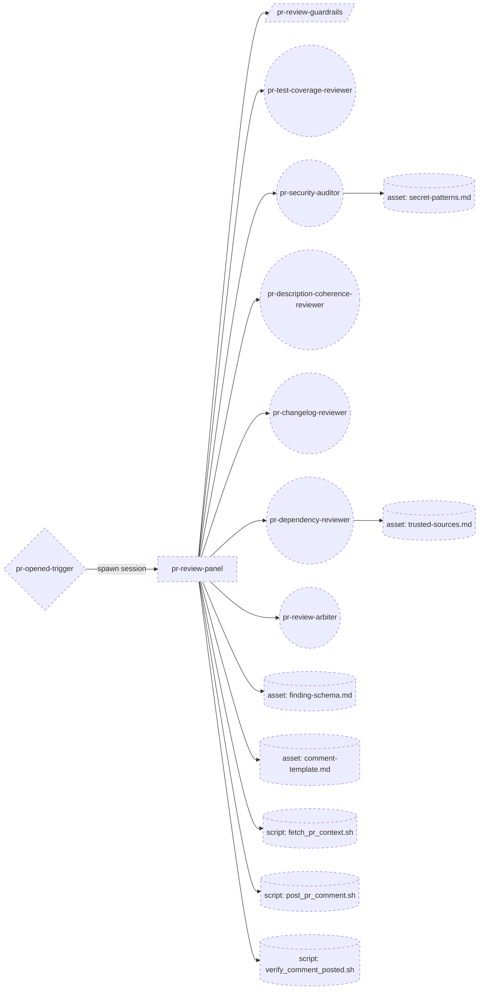
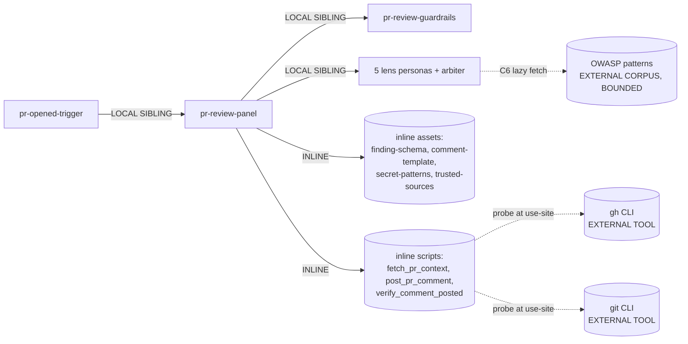

# Cold-load run: PR review panel (advisory)

> **Operator prompt (verbatim):**
>
> "I want an agent system that does end-to-end PR review on my open-source repo: code changes for bugs and design issues, test coverage, security and accidentally-leaked secrets, documentation freshness, and changelog. Aggregate everything into one comment posted back on the PR. Never approve, never auto-merge, just gather and present."
>
> **Regime:** multi-primitive advisory
> **Key pattern decisions:** A6 EVENT-DRIVEN + A1 PANEL + DISSENT-WEIGHTED arbiter. R1 SPLIT considered and applied at lens content as R3 EXTRACT.
>
> Output below is the verbatim response of a fresh agent session that
> loaded only `SKILL.md` and the prompt above. No prior context. No
> human cleanup. Execution stopped at the step-6 handoff packet per
> the skill's hard rule.

---

I have loaded SKILL.md, the architect persona, and the assets the skill demands at steps 2 / 3 / 3.1 / 3.5 (`primitives.md`, `design-patterns.md`, `architectural-patterns.md`, `refactor-patterns.md`, `mermaid-conventions.md`, `composition-substrate.md`, `pattern-tradeoffs.md`), the canonical multi-lens worked example, and `runtime-affordances/common.md`. Executing the 8-step process now. (The skill stops at step 6; steps 7-8 are noted as out-of-scope for this run.)

---

# genesis design run -- pr-review-panel

## Step 1 -- intent + scope

**Capability paragraph.** When a pull request is opened (or updated) on this open-source repository, run a multi-lens automated review that gathers findings across five independent inspection axes -- test coverage of the diff, security smells (secrets, unsafe deserialization, SQL-injection patterns), PR-description-vs-diff coherence, changelog updates for user-facing changes, and new-dependency hygiene (pinning + trusted sources) -- and post a SINGLE structured review comment with line-anchored findings. Boundary: this system NEVER approves, NEVER requests changes via the GitHub review API, and NEVER auto-merges; it only gathers and presents. It does not modify code, does not push commits, does not edit the PR body. It is a presenter, not an approver.

**SRP analysis (R1 SPLIT triggers, run honestly).**

The user prompt connects multiple capabilities with "and" -- which on its face is an R1 SPLIT trigger (DESCRIPTION CONJUNCTION). But R1 cuts at the level of the *dispatch surface*, not at the level of internal lenses. The user's request is ONE dispatch trigger ("PR opened -> run review") that is internally a multi-lens fan-out. Compare to the canonical `apm-review-panel` worked example: 5+ specialists, 1 arbiter, 1 dispatch surface. Same shape.

R1 SPLIT triggers checked against the proposed `pr-review-panel` entrypoint:

| R1 trigger              | Fires? | Reasoning |
|-------------------------|--------|-----------|
| DESCRIPTION CONJUNCTION | NO     | Description names ONE verb (review) ONE noun (PR). The lenses are internal decomposition, not multiple capabilities at the dispatch surface. |
| FRAGMENT CALLERS        | NO     | All five lenses run on every PR; no caller asks for "just security". If that need ever appears, R1 SPLIT then. |
| BODY OVER BUDGET        | NO     | Orchestrator body is short; lens content lives in sibling persona files (R3 EXTRACT applied below). |
| MULTI-LENS BODY         | YES at the *naive* design (one thread plays all 5 lenses) -- which is exactly the FAN-OUT-IN-ONE-CONTEXT anti-pattern. The cure is **threading topology** (B1 FAN-OUT + SYNTHESIZER), NOT primitive splitting. R1 does NOT fire at the entrypoint; it fires at the lens *content* and the cure is R3 EXTRACT (each lens to its own persona file). |
| DIVERGENT CHANGE CADENCE | YES at the lens content (security rules drift independently from test-coverage heuristics) -- again cured by R3 EXTRACT, not R1 SPLIT of the entrypoint. |

**Decision: KEEP the entrypoint as one dispatch surface (`pr-review-panel`).** Apply R3 EXTRACT to put each lens in its own PERSONA SCOPING FILE so each lens can be loaded into its own fresh CHILD-THREAD SPAWN (B1). PREMATURE SPLIT of the entrypoint is the failure mode the worked example explicitly warns against -- five sibling skills would multiply dispatcher collision risk for content that is always co-invoked.

**Dispatch description draft (frontmatter `description`, <=1024 chars, imperative, intent-first, indirect triggers named, BOTH invocation mode -- forced by trigger orchestrator, also discoverable when a maintainer says "review this PR"):**

> Use this skill to perform an automated multi-lens review of a pull request on this repository, posting one structured comment with line-anchored findings. Activate when a pull request is opened, reopened, synchronized, or marked ready for review; also activate when a maintainer asks to "review the PR", "audit this change", "check coverage / security / changelog / dependencies on the PR", or "scan this diff before merge". Covers test-coverage gaps, security smells (secrets, unsafe deserialization, SQL-injection patterns), PR-description coherence with the actual diff, changelog updates for user-facing changes, and new-dependency pinning / trusted-source hygiene. This skill never approves, never requests changes via the review API, never merges, and never modifies code -- it only gathers findings and posts one comment. Do not use for: drafting PR descriptions, fixing the issues it surfaces, or shipping releases.

Length: ~970 chars. Imperative, names trigger nouns/verbs and indirect-trigger phrases, names the boundary (never approves/merges/edits), names the not-for cases.

---

## Step 2 -- component diagram

Patterns loaded and considered: `primitives.md` (TIER 0), `design-patterns.md` (TIER 2), `architectural-patterns.md` (TIER 3), `refactor-patterns.md` (R-tier), `mermaid-conventions.md`.

**TIER 3 selection.** Two architectural patterns COMPOSE here:
- **A6 EVENT-DRIVEN** for the outer shape (PR opened -> handler fires). Substrate: TRIGGER ORCHESTRATOR.
- **A1 PANEL** as the handler body (5 independent lenses + 1 arbiter + 1 single-writer output). The lens-count gate (>=3 independent lenses, no shared state) FIRES at 5.
- **A9 SUPERVISED EXECUTION** wraps the tail of the panel because the synthesis output crosses S7 DETERMINISTIC TOOL BRIDGE (read PR diff = FACT THAT MUST BE TRUE; post single comment = CONSEQUENTIAL SIDE EFFECT against GitHub-the-system-of-record). The verifier step is itself a tool call (re-read posted comments), not an LLM "did it work?" pass.

**TIER 2 decomposition.**
- B1 FAN-OUT + SYNTHESIZER (panel topology)
- C2 PERSONA PRELOAD x 5 lenses + 1 arbiter (each with GROUNDED EXPERT BRIEFING -- each lens persona cites the corpus it reads from: e.g. security lens cites OWASP secret-pattern catalogue; dependency lens cites the project's lockfile + trusted-source allowlist)
- C3 THREAD SPAWN per lens (fresh context windows, isolation)
- S4 VALIDATION DECORATOR at the synthesis input gate (all lenses returned a finding object that matches the structured contract) and at the post-comment verifier
- S6 RULE BRIDGE -- the "never approve / never merge / never edit code" guardrail extracts to a SCOPE-ATTACHED RULE FILE (auto-loads whenever the panel skill is active) so the constraint varies independently of lens voices
- S7 DETERMINISTIC TOOL BRIDGE x 2 places: (a) reading the diff / PR metadata / changelog / lockfile (FACTS), (b) posting the single comment (SIDE EFFECT)
- B4 PLAN MEMENTO -- the persisted findings table + the synthesized comment draft is the plan artifact across spawns
- B8 ATTENTION ANCHOR -- the GOAL ("present findings, never approve, never merge, single comment, line-anchored") is re-injected before each spawn and before the post-comment tool call
- C6 EXTERNAL CORPUS GROUNDING (BOUNDED) -- security lens grounds against OWASP top-10 patterns; changelog lens grounds against the project's CHANGELOG conventions doc; dependency lens grounds against the project's trusted-source allowlist file. Each declaration states what the corpus is authoritative FOR (security patterns NOT for severity scoring; OWASP framing NOT imported into the panel's overall taxonomy).

**Component diagram (flowchart).**



All boxes are NEW. Node shapes follow `mermaid-conventions.md`: `((..))` PERSONA, `[..]` SKILL, `[/../]` RULE, `{..}` ORCHESTRATOR, `[(..)]` ASSET.

---

## Step 3 -- thread / sequence diagram

**Pattern selection runs in tier order:**

1. **Refactor triggers (run first).** R3 EXTRACT applied at lens-content level (each lens to its own persona file). R1 SPLIT NOT applied at the entrypoint (no triggers fire). R2 FUSE not applicable (no existing siblings). R4 INLINE not applicable (no thin proxies). Module graph is clean before pattern selection.
2. **TIER 3.** EVENT-DRIVEN (outer) + PANEL (handler) + SUPERVISED EXECUTION (tail). Inheriting their anti-patterns: PANEL-IN-ONE-CONTEXT (cured by per-lens spawn), PANEL-WITHOUT-SYNTHESIS (cured by arbiter), IMBALANCED PANEL (arbiter must surface dissent verbatim), PLAN-AND-PRAY / VERIFY-WITH-LLM-ONLY (cured by S7 + tool verifier), HARNESS-LLM CONFLATION (the LLM never "posts" -- it composes the comment body; the tool posts).
3. **TIER 2.** Listed in step 2.
4. **TIER 1.** Deferred to step 7b (codegen).

**Sequence diagram.**

```mermaid
sequenceDiagram
    participant Trigger as pr-opened-trigger
    participant Orch as pr-review-panel (orchestrator thread)
    participant Tool as TOOL (gh CLI / shell)
    participant L1 as pr-test-coverage-reviewer
    participant L2 as pr-security-auditor
    participant L3 as pr-description-coherence-reviewer
    participant L4 as pr-changelog-reviewer
    participant L5 as pr-dependency-reviewer
    participant Arb as pr-review-arbiter

    Trigger->>Orch: spawn(session, pr_number, repo)
    Note over Orch: B4 write plan + B8 inject GOAL ("never approve/merge, single comment, line-anchored")
    Orch->>Tool: fetch_pr_context.sh PR=N (diff, metadata, description, changed files)
    Tool-->>Orch: structured PR context (JSON on stdout)
    Note over Orch: S4 gate -- context fetched, schema valid, else abort
    Orch->>L1: spawn(persona=test-coverage, input=PR context slice, deny: write tools, gh review/merge)
    Orch->>L2: spawn(persona=security, input=PR context + secret-patterns.md, deny as above)
    Orch->>L3: spawn(persona=desc-coherence, input=PR context, deny as above)
    Orch->>L4: spawn(persona=changelog, input=PR context + CHANGELOG diff, deny as above)
    Orch->>L5: spawn(persona=dependency, input=PR context + trusted-sources.md, deny as above)
    L1-->>Orch: findings[] (schema: finding-schema.md)
    L2-->>Orch: findings[]
    L3-->>Orch: findings[]
    L4-->>Orch: findings[]
    L5-->>Orch: findings[]
    Note over Orch: S4 gate -- 5 findings objects present, schema-valid; B8 re-inject GOAL
    Orch->>Arb: spawn(persona=arbiter, input=all findings + comment-template.md)
    Arb-->>Orch: synthesized comment body (DISSENT-WEIGHTED, line-anchored)
    Note over Orch: B5 ACCEPTANCE OBSERVER -- re-read GOAL from plan, compare against draft (no approve/merge verbiage; one comment; anchors present)
    Note over Orch: B8 re-inject GOAL before tool call
    Orch->>Tool: post_pr_comment.sh PR=N body=draft.md (S7 SIDE EFFECT, single-writer)
    Tool-->>Orch: post receipt (comment URL)
    Orch->>Tool: verify_comment_posted.sh PR=N expected_marker=...
    Tool-->>Orch: verified pass/fail
    Note over Orch: single-writer interlock on PR comment sink; on fail -> abort, no retry on side-effect
```

The `==>` convention from `mermaid-conventions.md` is reserved for `flowchart`-rendered A9 diagrams; in `sequenceDiagram` the equivalent is the `Tool-->>Orch` return annotated in step 5 below as a tool-result crossing.

---

## Step 3.1 -- tradeoff check

Two slots had alternatives in tension. Cite per `pattern-tradeoffs.md`:

**Tradeoff A: synthesis style at the arbiter.** Candidates: CONSENSUS, MAJORITY, **DISSENT-WEIGHTED**, CEO-ARBITRATED. Cite `pattern-tradeoffs.md` matrix #5 (Synthesis style). Selected row: **DISSENT-WEIGHTED**. Reasoning: technical review surface; no goal-axis tradeoffs between lenses (they cover orthogonal axes, not competing optimization targets, ruling out CEO-ARBITRATED); CONSENSUS would block on any disagreement and the user wants gather-and-present, not block; MAJORITY would suppress single-lens findings (e.g. one secret detected by L2 alone is the highest-info signal -- exactly the IMBALANCED PANEL anti-pattern). DISSENT-WEIGHTED preserves every lens's findings verbatim in the comment.

**Tradeoff B: gate type for the post-comment step.** Candidates: S4 ACCEPTANCE OBSERVER (programmatic-internal), B9 GOAL STEWARD (judgement-internal), B10 HUMAN CHECKPOINT (judgement-external). Cite `pattern-tradeoffs.md` matrix #2 (Gate types) and matrix #9 (Execution doctrine). Selected: **B5 ACCEPTANCE OBSERVER + S4 schema validation, NO B10 HUMAN CHECKPOINT**. Reasoning: posting a non-destructive comment is not irreversible (an erroneous comment can be edited or deleted), the action is bounded by the SCOPE-ATTACHED RULE FILE (no approve/merge tools available in the spawn), and matrix #2 says "a human checkpoint will not catch a schema violation" -- the failure mode here is "comment doesn't follow template" or "comment claims approval" which an S4 deterministic check catches. B10 would be CHATTY GATE on every PR. The boundary that genuinely is irreversible (`gh pr review --approve`, `gh pr merge`) is enforced upstream via tool-deny-list at spawn time, not via runtime checkpoint.

**Tradeoff C: persistence shape.** Candidates: B4 alone vs B8 alone vs **B4 + B8 combined**. Cite matrix #7 (Plan persistence). Selected: **B4 + B8 combined** -- the work is multi-step AND spawn-bound (six spawns: five lenses + arbiter), so per the matrix's selection rule "if the work is multi-step OR multi-file OR spawn-bound, COMBINE B4 + B8".

---

## Step 3.5 -- composition decision

Loaded `composition-substrate.md`. Per-box composition mode and rationale:

| Box                                | Mode             | Rationale (substrate concept) |
|------------------------------------|------------------|-------------------------------|
| `pr-opened-trigger` (orchestrator) | LOCAL SIBLING    | Lives in this repo's CI surface; not reused across orgs; no rule-of-three. PORTABILITY MODE concern: the trigger declaration itself IS harness-specific (event-trigger DSL); only emitted at step 7b. |
| `pr-review-panel` (skill)          | LOCAL SIBLING    | Project-specific configuration of lenses for THIS repo's policies. Could be promoted later if rule-of-three fires across multiple OSS repos. |
| `pr-review-guardrails` (rule)      | LOCAL SIBLING    | Repo-specific guardrail (the "never approve/merge" line is invariant across orgs but the *scope predicate* is repo-shaped); INLINE within the skill bundle as scripts/ directory peer is also acceptable. Choose LOCAL SIBLING so it auto-loads via path scope without the skill having to invoke it. |
| 5 lens personas + arbiter persona  | LOCAL SIBLING    | All co-evolve with the project's review policy; no rule-of-three; no different owner. R3 EXTRACT applied per lens (one persona per file) to keep CHILD-THREAD SPAWN payload focused. |
| `finding-schema.md`                | INLINE asset     | Used only by this skill; defines the per-lens output contract. |
| `comment-template.md`              | INLINE asset     | Used only by the arbiter; defines the structured comment shape. |
| `secret-patterns.md`               | INLINE asset     | Project-tuned regex set; the skill is opinionated about which patterns it cares about. (Could later be EXTERNAL MODULE if rule-of-three fires; not now.) |
| `trusted-sources.md`               | INLINE asset     | Project allowlist of dep registries / org publishers. INLINE today; EXTERNAL candidate if shared across repos. |
| 3 scripts in `scripts/`            | INLINE asset     | Thin shell wrappers around `gh` and `git`; non-interactive, version-pinned, `--help` documented, structured stdout / diagnostic stderr per agentskills.io scripts conventions. |
| `gh` CLI                           | EXTERNAL TOOL    | NOT a module-system module; it is a SUBSTRATE TOOL the harness reaches via PRELOADED TERMINAL ROUTE (S7 selection rule: "if a preloaded CLI already does it -> route 1"). DECLARATION MECHANISM: companion-tool recommendation in the SKILL.md body PLUS a tool-call probe at use-site (`command -v gh >/dev/null || { echo "gh CLI required" >&2; exit 2; }`). This mirrors the A9 SUPERVISED EXECUTION probe pattern the skill itself applies at step 7b. NOT recorded as a manifest dep because (a) `gh` is not a skill/module, (b) the project's module-system adapter does not (today) declare CLI binaries. |
| `git` CLI                          | EXTERNAL TOOL    | Same treatment as `gh`: preloaded terminal, probe at use-site. |
| OWASP secret-patterns reference    | EXTERNAL CORPUS  | C6 EXTERNAL CORPUS GROUNDING (BOUNDED). The security lens cites OWASP for pattern *names*, not for severity / triage / scoring. Authority bounded explicitly in the lens persona body. Lazy fetch by URL only when the persona briefs itself. |

**External MODULES required: NONE.** No module-system adapter is needed at step 7b. No PHANTOM DEPENDENCY risk through the module-system surface.

**External SUBSTRATE TOOLS required: `gh`, `git`.** Declaration mechanism per tool: companion-tool recommendation in SKILL.md body + tool-call probe (`command -v <tool>`) at use-site. This is the analog of the apm-usage adapter probe for the substrate layer -- same A9 SUPERVISED EXECUTION discipline, applied to CLI binary reachability.

**Dependency graph diagram (flowchart LR).**



No edges cross a module-system DISTRIBUTION BOUNDARY. The two `EXTERNAL TOOL` cylinders cross the LLM/CPU boundary via S7, not the module distribution boundary.

---

## Step 4 -- SoC pass

Per-module check against the rules in SKILL.md step 4:

| Module | Existing-overlap | Sibling-trigger overlap | Dispatch collision | R1 SPLIT triggers | R2 FUSE | R3 EXTRACT | R4 INLINE | S7 needed? |
|---|---|---|---|---|---|---|---|---|
| `pr-opened-trigger` | None known. If repo already has a CI workflow on `pull_request`, redraw with that as the existing surface. | N/A (unique event handler) | N/A (orchestrator, not dispatcher-matched) | none fire | n/a | n/a | n/a | N/A (declarative) |
| `pr-review-panel` | None | None | Dispatch description sharpened to name "review", "audit", "scan PR" verbs; collisions checked against any existing `*-review*` skill. Severity if collision found: HIGH. | none fire (single dispatch surface for one capability) | n/a | n/a | n/a | YES at script boundaries (see below) |
| `pr-review-guardrails` (rule) | None | Auto-loads on path scope; no collision possible at dispatch (rules are not dispatched). | n/a | none | n/a | n/a | n/a | N/A |
| Each lens persona | None | Lens personas are NOT dispatcher-visible (loaded via spawn, not via description). | n/a | none (one lens per file) | n/a | (already extracted) | n/a | NO -- personas are pure inference scoping |
| Arbiter persona | None | Same -- spawn-loaded | n/a | none | n/a | already extracted | n/a | NO |
| Inline assets | None | n/a | n/a | n/a | n/a | n/a | n/a | NO |
| Scripts | None | n/a | n/a | n/a | n/a | n/a | n/a | THEY ARE THE BRIDGE |

**W6 / W6.2 -- CONSEQUENTIAL SIDE EFFECTS and FACTS THAT MUST BE TRUE (these MUST cross S7).**

| Step                           | Kind                | Tool-delegated via                                                    | Substrate route (S7)            |
|--------------------------------|---------------------|-----------------------------------------------------------------------|----------------------------------|
| Read PR diff                   | FACT                | `gh pr diff <N>` invoked from `fetch_pr_context.sh`                   | PRELOADED TERMINAL (route 1)     |
| Read PR metadata + description | FACT                | `gh pr view <N> --json title,body,author,baseRefName,headRefName,files` | PRELOADED TERMINAL              |
| Read changed files / changelog | FACT                | `git diff <base>...<head> -- CHANGELOG.md` and similar                | PRELOADED TERMINAL               |
| Read dependency manifests      | FACT                | shell `cat`/`jq` against package.json/requirements.txt/etc.           | PRELOADED TERMINAL               |
| Detect secrets / SQLi patterns | FACT (computation)  | regex script over diff hunks; OPTIONAL `gitleaks` if available (probe) | PRELOADED TERMINAL               |
| Compose finding objects        | LLM JUDGEMENT       | (no S7; this is the LLM's job per matrix #9 row 3)                    | LLM-OWNED                        |
| Compose comment body           | LLM JUDGEMENT       | (no S7; arbiter persona output)                                       | LLM-OWNED                        |
| Post the single comment        | SIDE EFFECT         | `gh pr comment <N> --body-file <draft>` from `post_pr_comment.sh`     | PRELOADED TERMINAL               |
| Verify the comment was posted  | FACT (verification) | `gh pr view <N> --json comments` + grep marker, in `verify_comment_posted.sh` | PRELOADED TERMINAL       |
| ENFORCE never-approve / never-merge | BOUNDARY (negative side-effect prevention) | Tool-deny-list at spawn time + `pr-review-guardrails` rule file body | SPAWN PARAMETER + RULE FILE |

**W6.3 -- PHANTOM DEPENDENCY check.**

The handoff packet declares NO external MODULES. It declares two external SUBSTRATE TOOLS (`gh`, `git`) and one external CORPUS (OWASP). For each, the DECLARATION MECHANISM is recorded:

- `gh`: companion-tool recommendation in SKILL.md body ("requires `gh` CLI authenticated against this repo") + tool-call probe at use-site (`command -v gh` and `gh auth status` checked at the top of every script that invokes `gh`).
- `git`: same.
- OWASP corpus: C6 EXTERNAL CORPUS GROUNDING with BOUNDED SCOPE declared in the security lens persona body ("authoritative for pattern names; NOT authoritative for severity, triage, or this panel's overall taxonomy").

If the project's module-system adapter (`apm-usage`) is reachable at step 7b and the lens personas, arbiter, rule, and panel skill are themselves bundled as a single APM module for cross-repo reuse, THEN those internal cross-references become manifest deps and the PHANTOM DEPENDENCY check moves to that surface. In the present design (single-repo, LOCAL SIBLING for everything), there is no PHANTOM DEPENDENCY risk through the module-system surface.

---

## Step 5 -- compliance check

| Axis                     | Verdict | Notes |
|--------------------------|---------|-------|
| SoC                      | PASS    | Each lens = one specialty; arbiter = one synthesis role; rule = one constraint set; trigger = one event surface. |
| Single Responsibility    | PASS    | Each persona one lens; the panel skill one workflow. |
| Encapsulation            | PASS    | Skill exposes one entrypoint; assets lazy-load (C1 + S5). |
| Composition over inheritance | PASS | Skill links to personas / rule / scripts; no inlined persona content. |
| Dependency inversion     | PASS    | Architect persona is ignorant of `gh`/`git` syntax inside the skill body; scripts encapsulate the CLI calls (S2 DEPENDENCY ADAPTER + S7 boundary). |
| Process/thread isolation | PASS    | One thread per lens; arbiter in its own thread; no shared window. |
| Fan-out / fan-in         | PASS    | B1 realized; PANEL anti-patterns inherited and cured. |
| Atomicity / interlock    | PASS    | Single-writer interlock on the PR comment sink: only the orchestrator thread invokes `post_pr_comment.sh`; the arbiter cannot post (no tool); lenses cannot post (deny-list). |
| Open-closed              | PASS    | New lens added by adding a persona file + spawn line; no existing lens edited. |
| Cross-cutting concerns   | PASS    | `pr-review-guardrails` carries the never-approve/merge constraint as a SCOPE-ATTACHED RULE so every lens persona inherits it without inlining. |
| **PROSE: Progressive Disclosure** | PASS | Personas + assets lazy-load per spawn / per step. |
| **PROSE: Reduced Scope** | PASS    | Each lens spawn carries only its slice of PR context. |
| **PROSE: Orchestrated Composition** | PASS | A1 PANEL with explicit synthesis. |
| **PROSE: Safety Boundaries** | PASS | Tool deny-list + guardrails rule + S7 single-writer interlock + B5 acceptance check before post. |
| **PROSE: Explicit Hierarchy** | PASS | Trigger -> orchestrator skill -> spawned lens threads -> arbiter -> tool. |
| Truth #1 (context fragility) | PASS | B4 + B8 combined per matrix #7 selection. |
| Truth #2 (context explicit) | PASS | Lens spawns receive explicit PR context slice as task input; nothing tacit. Arbiter receives findings as text; does not load lens personas. |
| Truth #3 (probabilistic output) | PASS | S4 schema gate on lens findings; S4 schema gate on comment body; S7 for all facts and side effects. |
| Truth #4 (hallucination inherent) | PASS | C2 + GROUNDED EXPERT BRIEFING per lens; C6 BOUNDED grounding for security/dependency corpora. Optional A7 ADVERSARIAL REVIEW could layer if false-positive rate becomes a problem (deferred; not currently flagged). |
| Truth #5 (pretraining frozen) | PASS | Trusted-sources allowlist and changelog conventions are READ from project files at spawn time, not recalled. |
| Truth #6 (harnesses bridge) | PASS | All facts and side effects cross S7; bridge made explicit in scripts. |
| Truth #7 (composition first-class) | PASS | Composition modes recorded per box at step 3.5. |
| Truth #8 (plan before execution) | PASS | The handoff packet IS the plan; persisted at end of this step. |
| MODULE ENTRYPOINT canonical spec | PASS (design-time) | `name` = `pr-review-panel` matches `[a-z0-9-]`, length 15. Body budget will be enforced at step 7b (target <=500 lines, <=5000 tokens; lens content already extracted to siblings, so headroom is generous). |
| Description <=1024 chars, imperative, intent-first, indirect triggers named, boundary stated | PASS | Drafted at step 1, ~970 chars. |

**Open findings:** none at BLOCKER. One MEDIUM to note for step 7b: the skill should detect when running on a PR from a fork (where `GITHUB_TOKEN` may lack write permission to comment); the script `post_pr_comment.sh` should probe `gh auth status` + permission and degrade to "print the comment to the workflow log instead of posting" rather than fail silently. Surfaced now so step 7b doesn't miss it.

---

## Step 6 -- handoff packet

(This is the artifact passed forward. PERSIST per truth #5 / substrate concept 6 -- write to harness plan-store at step 7b boundary, or to `plan.md` in the session working area for portability.)

### Diagrams

- Component diagram: see step 2.
- Thread / sequence diagram: see step 3.
- Dependency graph: see step 3.5.

### Interface sketches per module

| Module | Type | Trigger | Inputs | Outputs | Depends on |
|---|---|---|---|---|---|
| `pr-opened-trigger` | ORCHESTRATOR | repo event: `pull_request` opened / reopened / synchronize / ready_for_review | event payload (PR number, repo) | spawns one session loading `pr-review-panel` with `(pr_number, repo)` | `pr-review-panel` (LOCAL SIBLING) |
| `pr-review-panel` | SKILL (entrypoint) | description-dispatched (BOTH mode: forced by trigger, also discoverable on maintainer turn) | `(pr_number, repo)` | one posted PR comment URL + verifier pass/fail | `pr-review-guardrails`, 6 lens/arbiter personas, 4 assets, 3 scripts; substrate tools `gh` + `git`; B4 plan store |
| `pr-review-guardrails` | RULE | path/scope: auto-load whenever `pr-review-panel` is active (or scope = "PR review work") | n/a | constraint text loaded into thread context | none |
| `pr-test-coverage-reviewer` | PERSONA | spawn-loaded by panel | PR context slice (diff, changed test files, test framework hints) | `findings[]` matching `finding-schema.md` (each: lens, severity, file, line_range, message, citation) | `finding-schema.md` |
| `pr-security-auditor` | PERSONA | spawn-loaded by panel | PR context slice + `secret-patterns.md` | `findings[]` | `finding-schema.md`, `secret-patterns.md`, OWASP corpus (C6 BOUNDED) |
| `pr-description-coherence-reviewer` | PERSONA | spawn-loaded by panel | PR context (description text, diff summary, changed files list) | `findings[]` (mismatches between described scope and actual diff) | `finding-schema.md` |
| `pr-changelog-reviewer` | PERSONA | spawn-loaded by panel | PR context + `git diff -- CHANGELOG.md` + project's changelog conventions | `findings[]` (e.g. "user-facing change without changelog entry") | `finding-schema.md`; project `CHANGELOG.md` (read at use-time) |
| `pr-dependency-reviewer` | PERSONA | spawn-loaded by panel | PR context (manifest diffs + lockfile diffs) + `trusted-sources.md` | `findings[]` (unpinned, untrusted source, version-jumped) | `finding-schema.md`, `trusted-sources.md` |
| `pr-review-arbiter` | PERSONA | spawn-loaded by panel | all 5 `findings[]` arrays + `comment-template.md` + GOAL anchor (B8) | structured comment body markdown (DISSENT-WEIGHTED, line-anchored) | `comment-template.md`, `finding-schema.md` |
| `finding-schema.md` | ASSET | lazy-load on lens spawn | n/a | structured spec for finding objects | none |
| `comment-template.md` | ASSET | lazy-load by arbiter | n/a | template (TL;DR + per-lens section + line-anchored findings table + footer "this is an automated review; not an approval") | none |
| `secret-patterns.md` | ASSET | lazy-load by security lens | n/a | regex catalogue (project-tuned subset of OWASP) | OWASP corpus (BOUNDED) |
| `trusted-sources.md` | ASSET | lazy-load by dependency lens | n/a | allowlist of registries / org publishers / source domains | none |
| `fetch_pr_context.sh` | SCRIPT (S7) | invoked by panel before fan-out | `--pr <N> --repo <owner/name>` | JSON on stdout: `{diff, metadata, description, changed_files, base, head}` | `gh`, `git`, probe at top |
| `post_pr_comment.sh` | SCRIPT (S7) | invoked by panel after arbiter returns | `--pr <N> --repo <owner/name> --body-file <path>` | comment URL on stdout | `gh`, probe + permission probe at top |
| `verify_comment_posted.sh` | SCRIPT (S7, S4-style) | invoked by panel after post | `--pr <N> --repo <owner/name> --marker <uuid>` | exit 0 if found, 1 if not | `gh`, `jq` |

### Module composition table (per box: INLINE / LOCAL SIBLING / EXTERNAL MODULE)

| Box | Mode | Rationale |
|---|---|---|
| `pr-opened-trigger` | LOCAL SIBLING | repo-specific event handler; not module-shaped today |
| `pr-review-panel` | LOCAL SIBLING | project configuration of lenses |
| `pr-review-guardrails` | LOCAL SIBLING | scope-attached rule; auto-loads via path scope |
| 5 lens personas + arbiter | LOCAL SIBLING (each) | co-evolves with project policy; no rule-of-three yet |
| 4 assets | INLINE | single-skill consumers |
| 3 scripts | INLINE | single-skill consumers; non-interactive, version-pinned, `--help`, structured stdout / stderr per agentskills.io scripts spec |
| `gh` CLI | EXTERNAL TOOL (substrate) | preloaded terminal; not a module-system module |
| `git` CLI | EXTERNAL TOOL (substrate) | same |
| OWASP corpus | EXTERNAL CORPUS (C6 BOUNDED) | lazy fetch; bounded authority declared in security lens persona body |

### External MODULES required

**None.** No module-system adapter must be loaded at step 7b for module-distribution purposes.

### External SUBSTRATE TOOLS required (with DECLARATION MECHANISM)

| Tool | Declaration mechanism | Probe at use-site |
|---|---|---|
| `gh` | companion-tool recommendation in SKILL.md body | `command -v gh && gh auth status` at top of every `gh`-using script |
| `git` | companion-tool recommendation in SKILL.md body | `command -v git` at top of every `git`-using script |
| `jq` (verifier) | companion-tool recommendation in SKILL.md body | `command -v jq` at top of `verify_comment_posted.sh` |

These are the analog of "manifest dep + tool-call probe" for the SUBSTRATE layer. They prevent the substrate-equivalent of PHANTOM DEPENDENCY (skill assumes `gh` is present and silently produces a useless review when it is not).

### Declared target set

`common-only` -- the design uses only PERSONA SCOPING FILE, MODULE ENTRYPOINT, SCOPE-ATTACHED RULE FILE, CHILD-THREAD SPAWN, TRIGGER ORCHESTRATOR, PLAN PERSISTENCE, and the PRELOADED TERMINAL tool-call affordance. All exist in `runtime-affordances/common.md`. Per-harness adapter loads only at step 7b for the trigger-event DSL syntax (the orchestrator is the only piece that varies across harnesses; everything else is portable).

### Invocation mode per module

| Module | Mode |
|---|---|
| `pr-opened-trigger` | event-driven (not dispatched) |
| `pr-review-panel` | BOTH (forced by trigger; also DISCOVERY when a maintainer types "review the PR") -- requires the sharper description drafted at step 1 |
| All personas + rule + assets + scripts | FORCED (loaded explicitly by the panel skill body or by the harness via path-scope rule load) -- no dispatcher exposure, so no description-collision risk for these |

### Open compliance findings (carried forward)

- MEDIUM: `post_pr_comment.sh` must probe write permission and degrade to log-only when the token lacks `pull-requests: write` (typical for fork PRs). Surfaced at step 5; address at step 7b.
- (No BLOCKER findings; design is releasable.)

### EVALS PLAN

**Content evals (2-3, run with-skill vs without-skill).**
1. PR with a missing test for a new public function: with-skill posts a "test coverage" finding pointing at the new function lines; without-skill produces no finding or generic prose.
2. PR adding a hard-coded API key: with-skill posts a CRITICAL secret finding line-anchored to the diff hunk; without-skill misses or scatters across multiple comments.
3. PR with PR description claiming "small refactor" while diff also adds a new dependency to an untrusted source: with-skill produces TWO findings (description-coherence + dependency-trust) line-anchored; without-skill conflates or misses one.

If any of the three shows no measurable delta vs without-skill, the skill is not adding value at that lens; redesign or delete that lens.

**Trigger evals (~20 queries, 60/40 train/val).**

Should-trigger (8-10 train + val):
- "review this PR"
- "audit the open pull request for security"
- "check the changelog on PR 142"
- "scan the diff before we merge"
- "did this PR add new dependencies? are they pinned?"
- "is the PR description accurate?"
- repository event: `pull_request: opened` payload
- "look over PR 88"
- "go over the open PR end-to-end"
- "anything risky in this PR?"

Should-NOT-trigger (8-10 train + val):
- "approve this PR" (boundary -- the skill never approves)
- "merge PR 142" (boundary)
- "fix the failing test in this PR" (different capability)
- "draft a PR description for me" (different capability)
- "rebase this PR onto main" (different capability)
- "what is in CHANGELOG.md?" (a read, not a review)
- "review this README draft" (different artifact class)
- "summarize the discussion on this PR" (different capability)
- "comment 'lgtm' on the PR" (writes a comment but is not a review)
- "show me the diff" (a read)

Validation split is the ship gate per `primitives.md` MODULE ENTRYPOINT canonical spec (rate >=0.5 on should-trigger, <0.5 on should-not-trigger).

### Todo list (handed off to the coder thread, with dependencies)

| id | title | depends_on |
|---|---|---|
| `t-plan-persist` | Persist this packet to plan store (or `plan.md`) | -- |
| `t-portability` | Step 7a: confirm `common-only` target holds; load `runtime-affordances/common.md` | `t-plan-persist` |
| `t-write-rule` | Draft `pr-review-guardrails` SCOPE-ATTACHED RULE FILE body (never approve / never merge / never edit code; tool deny-list expectations) | `t-portability` |
| `t-write-personas` | Draft 5 lens personas + 1 arbiter persona; each with GROUNDED EXPERT BRIEFING (citation pointers) | `t-portability` |
| `t-write-assets` | Draft `finding-schema.md`, `comment-template.md`, `secret-patterns.md`, `trusted-sources.md` | `t-write-personas` |
| `t-write-scripts` | Draft 3 scripts: non-interactive, `--help`, structured stdout / stderr; include probe-at-top per the DECLARATION MECHANISM table | `t-portability` |
| `t-write-skill` | Draft `pr-review-panel/SKILL.md` body: orchestration procedure, spawn calls, B4/B8 anchors, S4 gates, single-writer interlock, B5 acceptance check before post | `t-write-rule, t-write-personas, t-write-assets, t-write-scripts` |
| `t-write-trigger` | Draft `pr-opened-trigger` orchestrator (only step 7b that loads a per-harness adapter, for the event DSL) | `t-write-skill` |
| `t-evals` | Author `evals/evals.json` with 3 content evals + ~20 trigger evals (60/40 split) | `t-write-skill` |
| `t-validate` | Step 8 lint: name regex, parent-dir match, body budget, ASCII, common-only honored, no PHANTOM DEPENDENCY, scripts non-interactive + version-pinned, evals gate passes | all of the above |
| `t-real-task` | REAL-TASK REFINEMENT: run on at least one real PR; capture trace; revise from what actually happened | `t-validate` |

### Proposed file tree of the bundle (for step 7b)

```
.skills/pr-review-panel/                 # MODULE ENTRYPOINT
  SKILL.md                               # entrypoint, body <=500 lines / <=5000 tokens
  agents/
    pr-test-coverage-reviewer.agent.md   # PERSONA SCOPING FILE
    pr-security-auditor.agent.md
    pr-description-coherence-reviewer.agent.md
    pr-changelog-reviewer.agent.md
    pr-dependency-reviewer.agent.md
    pr-review-arbiter.agent.md
  rules/
    pr-review-guardrails.rule.md         # SCOPE-ATTACHED RULE FILE
  assets/
    finding-schema.md
    comment-template.md
    secret-patterns.md
    trusted-sources.md
  scripts/
    fetch_pr_context.sh                  # S7 substrate bridge (--help, structured I/O)
    post_pr_comment.sh                   # S7 substrate bridge
    verify_comment_posted.sh             # S7 + S4 verifier
  references/                            # any spillover from SKILL.md per agentskills.io spec
  evals/
    evals.json                           # 3 content evals + ~20 trigger evals (60/40)

.orchestrators/                          # TRIGGER ORCHESTRATOR (per-harness DSL at step 7b)
  pr-opened-trigger.<ext>                # only file with harness-specific syntax; loaded at 7b
```

(File extensions and exact folder names are HARNESS AFFORDANCES and are bound at step 7b by `runtime-affordances/per-harness/<x>.md`. The architect persona is deliberately ignorant of them; the tree above shows the SUBSTRATE LAYOUT, not the on-disk syntax.)

---

**DESIGN ENDS HERE.** Per SKILL.md: "Stop. Do not draft natural language." Steps 7a / 7b / 8 are the caller's / coder thread's responsibility, beginning with persisting this packet to the plan store and loading `runtime-affordances/common.md` for portability check.