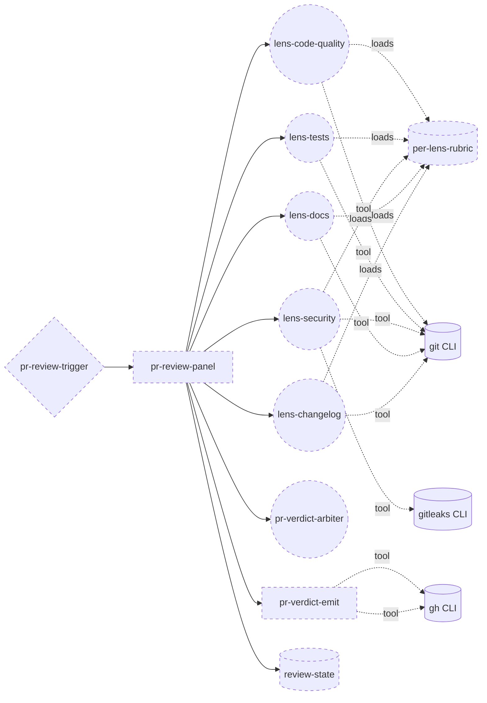
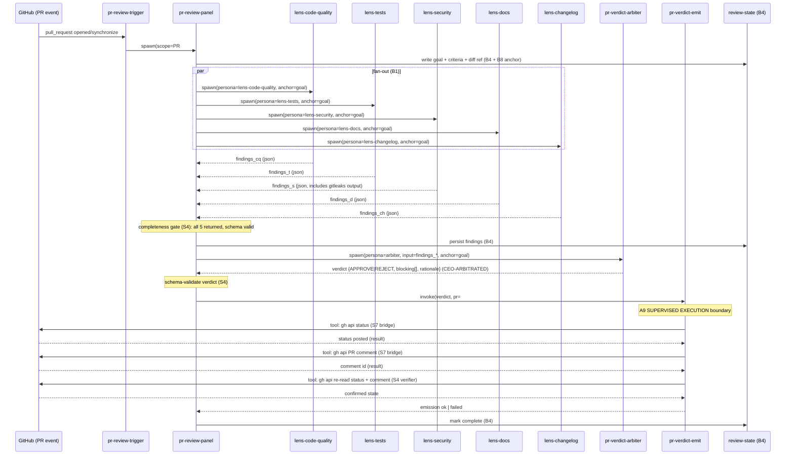
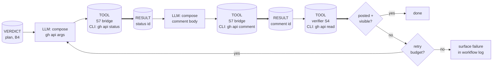
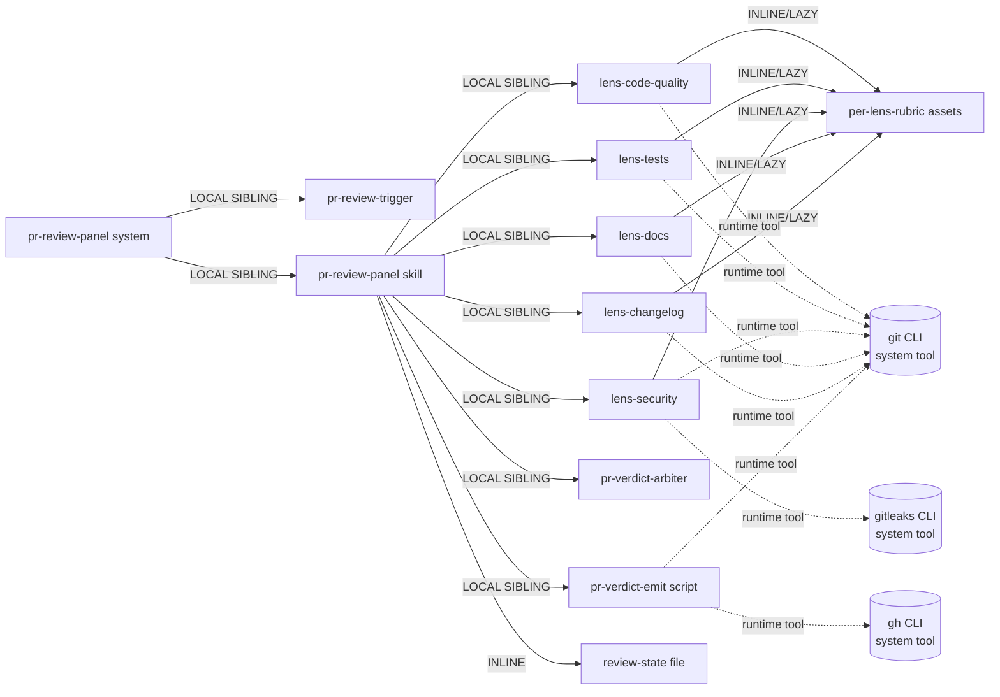

# Cold-load run: PR review with verdict (consequential)

> **Operator prompt (verbatim):**
>
> "I run an open-source TypeScript library on GitHub. I want an agent system that does end-to-end review on every pull request opened against my repo. It should look at code changes for bugs and design issues, check tests, scan for security problems and accidentally-leaked secrets, look at documentation freshness, and review the changelog. After it has gathered all of that, it must emit a verdict: APPROVE or REJECT the PR, and post that verdict back as a GitHub status check and a comment. I want the system to actually decide -- not just summarize."
>
> **Regime:** multi-primitive consequential
> **Key pattern decisions:** Regime change vs. example 04: A9 + S7 + S4 hardened around the verdict-emit boundary. A8 ALIGNMENT LOOP, B5 ESCALATION, R1 SPLIT all considered and rejected with WHEN-clause grounding.
>
> Output below is the verbatim response of a fresh agent session that
> loaded only `SKILL.md` and the prompt above. No prior context. No
> human cleanup. Execution stopped at the step-6 handoff packet per
> the skill's hard rule.

---

I have loaded the genesis discipline. Stopping after step 6 -- handoff packet follows.

---

# HANDOFF PACKET: pr-review-panel system

## Step 1 -- Intent + scope

A GitHub-side trigger watches `pull_request` events on a TypeScript OSS repo. On open / synchronize, it dispatches a multi-lens review panel that spawns five independent specialist lenses against the PR diff in parallel (code quality + design, tests, security + secret-scan, docs freshness, changelog), then a sixth thread (Arbiter) synthesizes a binary verdict APPROVE | REJECT with a blocking-issue list. The verdict is then materialized as TWO real artifacts on the PR: a GitHub status check (success/failure) and a single PR comment containing the structured rationale. The system DOES NOT auto-merge, auto-close, or push code; the human author still owns the merge action. It DOES NOT propose patches; it only judges.

Dispatch description (FORCED, not DISCOVERY -- invoked by the trigger orchestrator, not by a chat-side dispatcher):
> "Use this skill when a pull request is opened or updated against the repository's default branch and a binary, end-to-end review verdict (APPROVE or REJECT) must be emitted as both a GitHub status check and a single PR comment. Triggers indirectly on terms like 'review my PR', 'gate this PR', 'block on quality / tests / security / docs / changelog', 'should this merge', or any automation that needs a deciding (not summarizing) reviewer over a code diff. Out of scope: proposing patches, auto-merging, auto-closing, or modifying any branch."

## Step 2 -- Component diagram

Legend: `{}` ORCHESTRATOR, `[]` SKILL, `(())` PERSONA, `[()]` ASSET, `[(.)]` external CLI tool (system substrate, not a primitive). All primitives are NEW; system CLIs are pre-existing.

## Step 3 -- Sequence diagram

A9 SUPERVISED EXECUTION inset (verdict emission, the only crossing into a system of record):

Single-writer interlock: only `pr-review-panel` writes to `review-state`; only `pr-verdict-emit` writes to GitHub.

## Step 3.1 -- Tradeoff citations (alternatives weighed)

Patterns explicitly considered and accepted/rejected with WHEN-clause grounding:

- **A1 PANEL -- ACCEPTED.** WHEN clause: "A decision benefits from >=3 specialized lenses ... The lenses are independent; no shared state during evaluation. The synthesis is itself a decision, not a concatenation." Direct match: 5 lenses, diff is the only shared input (read-only), synthesis output IS the verdict.
- **A6 EVENT-DRIVEN -- ACCEPTED (outer shape).** WHEN clause: "Work is reactive: PR opened -> review starts ... Cadence is event-driven, not time-driven." Direct match: GitHub `pull_request` webhook is the producer, the panel is the handler.
- **A9 SUPERVISED EXECUTION -- ACCEPTED (verdict-emit step only).** WHEN clause: "The work names a SYSTEM OF RECORD (db, repo, cluster, file system, payment processor, queue) and a CONSEQUENTIAL ACTION against it." Operator quote: "post that verdict back as a GitHub status check and a comment ... it must actually decide." Status checks and PR comments ARE the system-of-record action; selection heuristic ("X actually happened in system Y, not 'we claim X happened'") cuts directly to A9. Verifier step is itself a tool call (gh api re-read), avoiding VERIFY-WITH-LLM-ONLY.
- **A8 ALIGNMENT LOOP -- CONSIDERED, REJECTED.** WHEN clause: "The first attempt is unlikely to satisfy the goal in one pass (creative work, positioning, complex synthesis). Goal drift is a real risk over several rounds." This work is NOT creative iteration -- the goal (judge a fixed diff against a fixed rubric) is unambiguous and one-shot per PR event. There is no "round N+1 with refined draft"; the next round is the next PR event (handled by A6, not A8). The goal-steward role A8 needs is supplied here by the Arbiter persona realizing B9 inside A1, without the bounded-iteration scaffolding A8 carries.
- **A7 ADVERSARIAL REVIEW + COLD READER -- CONSIDERED, REJECTED as outer shape.** WHEN clause: "Cold-traffic conversion matters (a README, a PR description, an incident write-up): the producer cannot judge clarity for someone who lacks their context." A code diff is not cold-traffic conversion content; the lenses ARE the adversarial readers (security-lens IS red team), so A7's contribution is already absorbed by A1 PANEL with adversarially-flavored persona briefings. Adding a separate A7 layer on top would be COSMETIC DISSENT.
- **A2 PIPELINE -- CONSIDERED, REJECTED.** Could express as fetch -> analyze -> verdict -> emit. But analyze is the parallel panel; flattening it into a sequential pipeline would defeat B1 fan-out's context-isolation win. PIPELINE returns at a SUB-scope (the Emit step internally sequences "post status -> post comment -> verify"), but that is captured by A9 already.
- **A4 STAFFED PLAN -- CONSIDERED, REJECTED.** Tasks-with-staffing pattern; but staffing here is fixed at design time (5 known lenses), there is no plan-time decomposition. PREMATURE STRUCTURE.
- **A5 WAVE EXECUTION -- CONSIDERED, REJECTED.** No DAG; lenses are mutually independent. WAVE-WITHOUT-GATE risk and no parallelism win beyond what A1 already gives.
- **B10 HUMAN CHECKPOINT before posting REJECT -- CONSIDERED, REJECTED for the verdict path.** Operator quote: "it must actually decide -- not just summarize." Operator explicitly delegated the decision. Status checks and comments are reversible (subsequent runs override; comments are editable), so they are NOT in the "irrecoverable" cell that mandates B10. Human override path remains: the PR author / human reviewers can still merge over a failing check using GitHub's existing branch-protection mechanics; that is the durable B10 surface, owned by GitHub, not by the agent.
- **S7 DETERMINISTIC TOOL BRIDGE for secret scanning inside lens-security -- ACCEPTED.** Selection heuristic from S7: "If a design step contains the words 'apply', 'delete', 'post', 'deploy', 'compute', 'verify' ... it MUST cross S7." Secret detection is "compute SHA-matches against known-secret patterns over the diff" -- a deterministic computation. `gitleaks` (preloaded-terminal route) is the canonical answer. Avoids HAND-ROLLED HALLUCINATION (LLM eyeballing 4000-line diffs for `AWS_SECRET_ACCESS_KEY`).
- **C6 EXTERNAL CORPUS GROUNDING for docs lens -- ACCEPTED, BOUNDED.** Docs freshness depends on present repo state (`docs/**/*.md` content vs. exported API surface), which truth #5 (frozen pretraining) cannot reliably hold. Lens fetches via `git ls-files docs/` + `git diff` (terminal route 1, lazy). Bounded scope: corpus authoritative for "what files exist now and what the diff touched", NOT for "is documentation good writing" (that is judgement).

Tradeoff matrices cited:

- Matrix #1 (Hallucination countermeasures): truth #2 (CONTEXT MUST BE EXPLICIT) + verdict-emission as fact-that-must-be-true -> S7 + A9 wraps the emit step. Truth #4 (HALLUCINATION INHERENT) for security -> S7 (gitleaks) + C2 GROUNDED EXPERT BRIEFING (security persona cites OWASP / CWE). Truth #1 -> B4 + B8 combined.
- Matrix #2 (Gate types) row INTERNAL VERDICT x JUDGEMENT VERDICT -> **B9 GOAL STEWARD** as the verdict gate (Arbiter persona). Row EXTERNAL VERDICT x PROGRAMMATIC VERDICT -> tool-call verifier on the gh-api re-read.
- Matrix #4 (Threading topology) row PARALLEL THREADS x NO SHARED STATE -> **B1 FAN-OUT + SYNTHESIZER**. Cell selected verbatim.
- Matrix #5 (Synthesis style) -> **CEO-ARBITRATED** ("best when lenses optimize for different axes"); the Arbiter is a B9 GOAL STEWARD persona. DISSENT-WEIGHTED was the runner-up; rejected because the operator explicitly demands a binary decision, not a weighted-rationale concatenation.
- Matrix #7 (Plan persistence) row "spawn-bound work" -> **B4 + B8 combined** (review-state file + per-spawn anchor of goal + criteria).
- Matrix #9 (Execution doctrine):
  - Lens analyses (composition / judgement) -> LLM-asserted. Cell row 3.
  - Secret scan (compute deterministic) -> Tool-delegated EAGER. Cell row 1.
  - Verdict emission (side effect on system of record) -> Tool-delegated. Selection rule 1. Reversibility analysis says no B10 needed.
  - Verifier of post (verify) -> Tool-delegated by ANOTHER tool (selection rule 4); avoid VERIFY-WITH-LLM-ONLY.

## Step 3.5 -- Composition decision + dependency graph

Composition table:

| Box                   | Mode          | Rationale                                                                                                  |
|-----------------------|---------------|------------------------------------------------------------------------------------------------------------|
| pr-review-trigger     | LOCAL SIBLING | Project-specific event glue; harness-syntactic; not reusable across other repos without re-customization.  |
| pr-review-panel       | LOCAL SIBLING | One per project; orchestrator facade S3.                                                                   |
| lens-* (5 personas)   | LOCAL SIBLING | Project-tuned rubrics (TS-specific lint expectations, this repo's test conventions, this repo's docs path).|
| pr-verdict-arbiter    | LOCAL SIBLING | Owns the project's quality bar; decision is project-policy-bound, not generic.                             |
| pr-verdict-emit       | LOCAL SIBLING | Thin script wrapping `gh` for this repo's status-check name + comment marker.                              |
| per-lens-rubric       | INLINE / LAZY | Each rubric loaded only when its lens runs (C1 LAZY ASSET).                                                |
| review-state          | INLINE        | Per-PR JSON file under `.review/<pr#>.json` in working tree; no cross-project reuse.                       |
| gh / git / gitleaks   | RUNTIME TOOL  | Pre-existing system CLIs supplied by the runner environment. NOT primitives; declared via probe + setup.    |

No EXTERNAL MODULE primitive dependencies. Rule of three does not fire (this is a single project's review system); independent release cadence does not fire; no different-team ownership; pinning happens at the runner-environment layer (gitleaks version pin in trigger setup). PROMOTION-WITHOUT-NEED averted.

DECLARATION MECHANISMS for runtime tools (NOT primitive deps, but loader-visible declarations to avoid PHANTOM DEPENDENCY): 
- `gh`, `git`: preloaded by GitHub Actions runner image; no install needed; trigger orchestrator sets `permissions: pull-requests: write, statuses: write, contents: read` -- this IS the loader-visible declaration.
- `gitleaks`: trigger orchestrator setup step pins and installs (`curl -sSfL ... | sh`); lens-security PROBES at use-site (`command -v gitleaks` -> if missing, lens returns `secret_scan: unavailable` finding rather than fabricating).

## Step 4 -- SoC pass

- No existing module on this project does PR review end-to-end; no duplication.
- Each lens persona = one Single Responsibility (one specialist domain).
- Arbiter is a distinct persona, NOT the panel orchestrator wearing a hat (avoids GOD-PERSONA).
- Panel orchestrator depends on each persona via link; persona content is NOT inlined.
- No DISPATCH COLLISION: all primitives invoked FORCED by parent (trigger calls panel; panel calls lenses by name). No DISCOVERY-mode siblings to disambiguate from.
- R1 SPLIT triggers checked: description contains no "and"-conjoined capabilities (the conjunction in the description is enumerating a SINGLE coherent capability "render a verdict from N lenses"); no fragment callers; bodies sized below budget; no multi-lens body (each lens IS its own body); divergent-cadence test: a security rule change does not force editing the docs lens. PASS.
- R2 FUSE check: no two lenses lockstep-co-invoke as a unit; each can in principle run alone (and DOES, when the trigger fires for a docs-only PR -- the design still spawns all five for uniformity, but each is independent). No fusion candidate.
- R3 EXTRACT check: per-lens rubric content is extracted into LAZY assets, not inlined into persona bodies (avoids EAGER BLOAT and supports cross-lens evolution).
- R4 INLINE check: no thin proxy primitives.
- CONSEQUENTIAL SIDE EFFECT scan (the `gh api` calls): named, bridged via S7, gated by S4 verifier. No prose-asserted "I posted the comment" anywhere.

## Step 5 -- Compliance check

PROSE 5-axis:
- Progressive Disclosure: PASS (per-lens rubric is C1 LAZY ASSET; arbiter persona loads only at synthesis spawn).
- Reduced Scope: PASS (each lens has its own fresh context window via B1).
- Orchestrated Composition: PASS (panel S3 ORCHESTRATOR FACADE; lenses are independent contracts).
- Safety Boundaries: PASS (S4 schema-validate verdict before EMIT; S7 bridge for posts; verifier re-reads; B4 plan persists).
- Explicit Hierarchy: PASS (trigger > panel > lenses + arbiter > emit; one-writer interlocks).

Seven LLM-physics truths:
- #1 finite/fragile context: B4 + B8 + B1 fresh-context spawns. PASS.
- #2 explicit context: anchor passed into each spawn; runtime tool deps declared in trigger setup; no PHANTOM DEPENDENCY. PASS.
- #3 probabilistic output: S4 schema-gate verdict; S7 verifier on post. PASS.
- #4 hallucination inherent: gitleaks for secrets (S7); GROUNDED EXPERT BRIEFING per persona (citations to OWASP/CWE/Testing-Pyramid/Conventional-Commits/Keep-a-Changelog). PASS.
- #5 pretraining frozen: docs lens reads live `git ls-files docs/`; changelog lens reads live `CHANGELOG.md` (C6 LAZY EXTERNAL). PASS.
- #6 harnesses bridge: trigger orchestrator is the only file that touches per-harness syntax. PASS.
- #7 plan before execution: B4 + handoff packet persisted before any spawn. PASS.

MODULE ENTRYPOINT canonical-spec compliance (deferred to step 8 lint, but pre-checked):
- `name` regex: all proposed names (`pr-review-panel`, `pr-review-trigger`, `lens-code-quality`, `lens-tests`, `lens-security`, `lens-docs`, `lens-changelog`, `pr-verdict-arbiter`, `pr-verdict-emit`) pass `[a-z0-9-]{1,64}`, no leading/trailing/consecutive hyphens.
- Description draft (Step 1) is 779 chars, < 1024 cap.
- SKILL.md bodies anticipated < 500 lines / < 5000 tokens; per-lens rubric overflow goes to `references/`.

Open findings: NONE at BLOCKER / HIGH severity. One MEDIUM watch item: the `lens-security` persona MUST cite OWASP / CWE corpus explicitly in its briefing or it degrades to NAMED-NOT-GROUNDED EXPERT (C2 sub-rule). Carried forward to step 7b drafting as a hard guardrail.

## Step 6 -- Interface sketches

| Module                   | Type         | Trigger                                     | Inputs                                                              | Outputs                                                  | Depends on                                                  |
|--------------------------|--------------|---------------------------------------------|---------------------------------------------------------------------|----------------------------------------------------------|-------------------------------------------------------------|
| pr-review-trigger        | ORCHESTRATOR | GitHub event: PR opened / synchronize       | repo, pr_number, base_sha, head_sha                                 | invokes pr-review-panel with scoped args                 | pr-review-panel                                             |
| pr-review-panel          | SKILL        | FORCED by trigger                           | pr_number, base_sha, head_sha                                       | persisted review-state; final verdict object             | all 5 lenses, pr-verdict-arbiter, pr-verdict-emit, review-state |
| lens-code-quality        | PERSONA      | FORCED spawn by panel                       | diff, anchor (goal+criteria)                                        | findings_cq json {blocking[], non_blocking[], summary}   | per-lens-rubric, git CLI                                    |
| lens-tests               | PERSONA      | FORCED spawn by panel                       | diff, anchor                                                        | findings_t json (same schema)                            | per-lens-rubric, git CLI                                    |
| lens-security            | PERSONA      | FORCED spawn by panel                       | diff, anchor                                                        | findings_s json (same schema, plus secret_scan field)    | per-lens-rubric, git CLI, gitleaks CLI (probe)              |
| lens-docs                | PERSONA      | FORCED spawn by panel                       | diff, anchor, repo file index                                       | findings_d json                                          | per-lens-rubric, git CLI                                    |
| lens-changelog           | PERSONA      | FORCED spawn by panel                       | diff, anchor, CHANGELOG.md content                                  | findings_ch json                                         | per-lens-rubric, git CLI                                    |
| pr-verdict-arbiter       | PERSONA (B9) | FORCED spawn by panel after fan-in          | findings_*, anchor                                                  | verdict json {decision: APPROVE\|REJECT, blocking[], rationale} | none (pure synthesis lens)                                |
| pr-verdict-emit          | SKILL        | FORCED by panel after S4 schema-gate        | verdict, pr_number                                                  | status_id, comment_id, verifier_ok                       | gh CLI, git CLI                                             |
| review-state             | ASSET        | written by panel only                       | -                                                                   | persisted JSON at `.review/<pr#>.json`                   | -                                                           |
| per-lens-rubric          | ASSET (C1)   | LAZY-loaded by each lens                    | -                                                                   | rubric markdown                                          | -                                                           |

External primitive modules required: NONE.

External runtime tools required (declared in trigger orchestrator setup, probed at use-site):
- `gh` (GitHub Actions runner pre-installed; declaration mechanism: workflow `permissions:` block).
- `git` (runner pre-installed; declaration mechanism: implicit in `actions/checkout`).
- `gitleaks` (declaration mechanism: pinned install step in trigger orchestrator setup, e.g. `gitleaks@v8.x.y`; lens-security PROBES at use-site via `command -v gitleaks`, reports `secret_scan: unavailable` rather than fabricating if missing). MIRRORS A9 SUPERVISED EXECUTION discipline.

Declared targets: `common-only` for all primitives EXCEPT `pr-review-trigger` (event-trigger surface is harness-specific by definition; per step 7 portability rules this constraint is declared in its header). Step 7a will confirm: all skill / persona / asset bodies use only common-substrate affordances (spawn, persona load, lazy asset load, plan persistence).

Intended invocation mode per module:
- `pr-review-trigger`: FORCED (event-bound, not dispatcher-resolved).
- `pr-review-panel`: FORCED (called by name from trigger).
- All lens-* + arbiter: FORCED (spawned by name from panel).
- `pr-verdict-emit`: FORCED (called by name from panel).
- Description-collision review = RELAXED; no DISCOVERY-mode siblings exist in this system.

PHANTOM DEPENDENCY CHECK:

| Named dep        | Where named                  | Loader-visible declaration                                  | Use-site probe              | Status |
|------------------|------------------------------|-------------------------------------------------------------|-----------------------------|--------|
| pr-review-panel  | trigger body                 | trigger references it by relative path; same-tree sibling   | n/a (LLM file-load)         | OK     |
| each lens persona| panel body                   | panel references each by relative path; same-tree sibling   | n/a                         | OK     |
| arbiter persona  | panel body                   | panel references by relative path; same-tree sibling        | n/a                         | OK     |
| per-lens-rubric  | each lens body               | each lens references its rubric by relative path; LAZY     | n/a                         | OK     |
| review-state     | panel + arbiter bodies       | panel writes; arbiter reads via path passed by panel       | n/a                         | OK     |
| `gh`             | pr-verdict-emit body         | trigger workflow `permissions:` block + runner image       | `command -v gh` at use-site | OK     |
| `git`            | every lens body, emit body   | runner image pre-install + `actions/checkout` step          | implicit                    | OK     |
| `gitleaks`       | lens-security body           | trigger workflow setup step pins + installs                 | `command -v gitleaks` at use-site; degrades gracefully | OK |

NO PHANTOM DEPENDENCIES. Every named dependency is reachable via either (a) a same-tree relative path to a sibling primitive, or (b) a runtime-environment declaration in the trigger orchestrator + a use-site probe that fails-loud rather than fabricating.

EVALS PLAN (per MODULE ENTRYPOINT canonical spec):

CONTENT EVALS (>=2 pairs, with-skill vs without-skill):
1. PR with a hardcoded `AWS_SECRET_ACCESS_KEY` in `src/config.ts` -> with: REJECT, secret_scan blocking; without: at-best-summary, no actual gh-api status posted. Delta: visible.
2. PR adding a public exported function with no jsdoc and no test -> with: REJECT, blocking from lens-tests + lens-docs; without: opinionated review text, no verdict, no status. Delta: visible.
3. PR fixing typo in CHANGELOG with no code change -> with: APPROVE; without: ambiguous. Delta: confirms decisiveness.

TRIGGER EVALS (~20):
- 10 should-trigger queries: "review PR #42", "gate this PR", "should this merge", "block on quality", "scan PR for secrets", "check if my PR is good", "decide on my PR", "approve or reject PR #N", "is this PR mergeable", "run the PR panel".
- 10 near-miss should-NOT-trigger: "summarize this issue thread", "draft a PR description", "explain the diff", "find similar PRs", "fix the failing test", "rebase my branch", "write a release note", "list open PRs", "show me the diff", "explain what this PR does".
- Split 60/40 train/val. Validation gate: >=0.5 hit rate on should, <0.5 on should-not.

TODOS (one entry per module to draft + validation), with dependencies:

| id              | title                                              | depends_on                          |
|-----------------|----------------------------------------------------|-------------------------------------|
| draft-trigger   | Draft pr-review-trigger (event glue + perms + setup)| draft-panel                         |
| draft-panel     | Draft pr-review-panel SKILL.md (B1 + S4 + B4 + B8) | draft-lens-*, draft-arbiter, draft-emit |
| draft-lens-cq   | Draft lens-code-quality persona + rubric (LAZY)    | -                                   |
| draft-lens-t    | Draft lens-tests persona + rubric                  | -                                   |
| draft-lens-s    | Draft lens-security persona + rubric + gitleaks probe block | -                          |
| draft-lens-d    | Draft lens-docs persona + rubric                   | -                                   |
| draft-lens-ch   | Draft lens-changelog persona + rubric              | -                                   |
| draft-arbiter   | Draft pr-verdict-arbiter persona (B9 GOAL STEWARD, CEO-ARBITRATED) | -                  |
| draft-emit      | Draft pr-verdict-emit script (S7 + S4 verifier + retry budget) | -                       |
| draft-evals     | Author content-evals + trigger-evals               | draft-panel                         |
| portability-7a  | Run portability check against common substrate     | all draft-*                         |
| validate-step8  | Run lint, schema, evals; one real-PR refinement    | portability-7a                      |

PERSIST: this packet is the plan. Persist to project plan store before step 7b begins; under genesis discipline, default to `plan.md` in the working area unless the harness adapter (loaded at step 7) defines a richer slot.

## STOP SIGNAL

DESIGN ENDS HERE. Step 7 (per-harness binding, runtime-affordances loading, natural-language module drafting) is OUT OF SCOPE for this packet, per operator constraint. Caller / coder thread takes over from this packet.