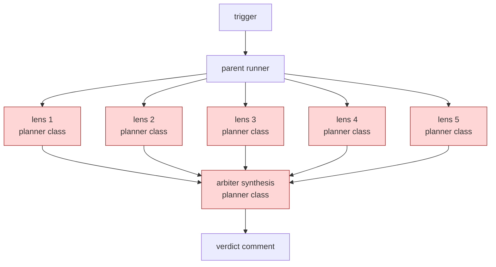
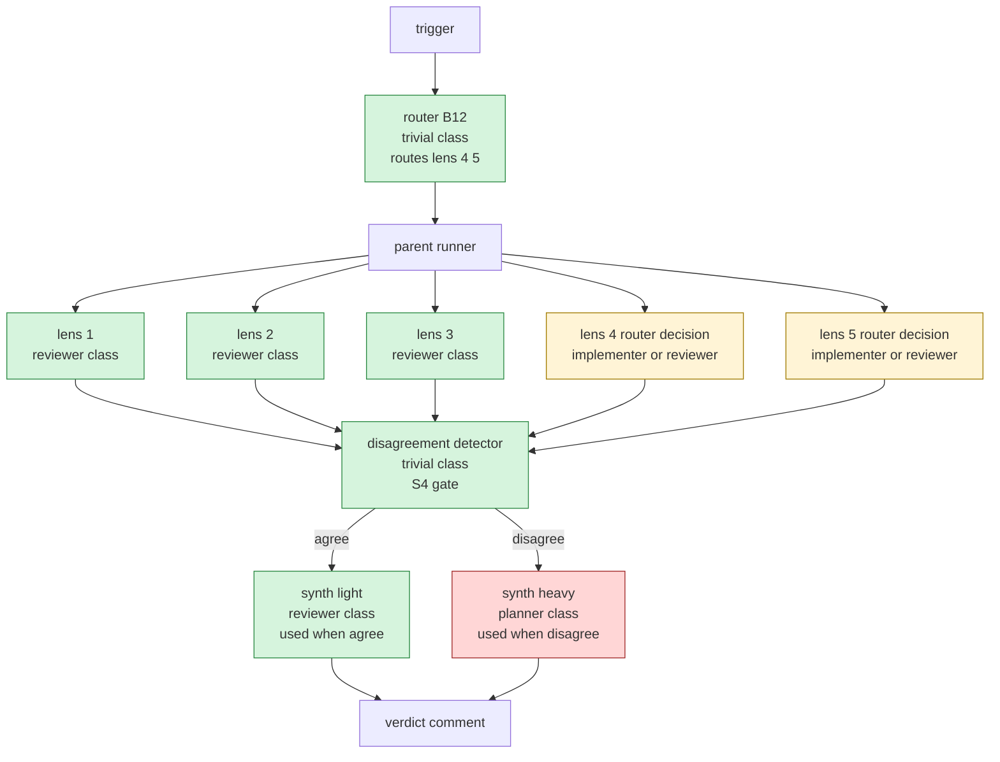

# Worked Example: Cost-Aware Re-architecture of a Review Panel

Load this file when the operator declares a `frugal` cost stance, OR
when an existing panel-shaped workflow runs frequently enough that
its cost-shape becomes the dominant design concern (fan-out width
>= 4, daily-or-more cadence). It walks one real panel from the
quality-correct, cost-unconscious shape in example 02 to a cost-
shape that holds quality while cutting per-run spend by an
operator-visible margin.

The example presumes you have read `examples/02-review-panel-
architecture.md` (the quality-correct starting point) and
`assets/token-economics.md` (the substrate vocabulary).

## The starting design (cost-unconscious)

The review panel from example 02 in its quality-correct shape:

The design is STRUCTURALLY correct: 5 lenses with no shared state
fan out into independent threads (no CONTEXT THRASH, no SHARED
MUTABLE STATE). It is COST-UNCONSCIOUS: 6 planner-class calls per
review, all paying the highest per-token rate the harness offers,
even though only one of them genuinely needs the planner's reasoning
ceiling.

### Cost-shape analysis (step 3.2 against the design as drawn)

| Module       | Role class | Prefix size | Output volume | Invalidators? |
|--------------|------------|-------------|---------------|----------------|
| lens 1-5     | planner    | M (each)    | M (each)      | none           |
| arbiter      | planner    | M           | M             | none           |

Trigger fires for R5 COST PRUNE: CLASS-UNIFORM GRAPH. Every module
in the design binds planner class. At least one (and likely four)
of the lenses are doing routine reviewer-class work (pattern-match
against rubric, emit verdict). The arbiter is the genuine planner
slot (cross-lens synthesis under tension is a "wrong plan" failure
mode, not a "minor edit miss").

## The cost-aware re-architecture

Apply A12 GRADIENT WORKFLOW: heavy front for planning, lighter
middle for per-lens execution, lighter back for synthesis-with-
disagreement-detection. The arbiter stays planner-class ONLY when
the lenses surface disagreement; otherwise a reviewer-class
synthesizer suffices.

Patterns applied (each cited against the cost-shape matrix in
`assets/pattern-tradeoffs.md` section 10):

- A12 GRADIENT WORKFLOW. Matrix row: "Fan-out across N similar
  items / Output bytes x N / Heavy role class on workers".
- B12 MODEL ROUTER. Matrix row: "Single-turn classification or
  extraction / Per-call rate / Wrong role class". The router
  itself is trivial-class and costs less than 5% of the
  cheapest downstream call.
- B13 CACHE-AWARE PREFIX. Matrix row: "Long-running session,
  mostly read-only / Input prefix re-billed each turn / Cache
  invalidator". Persona + skill bodies held stable across the
  panel's lifetime; per-lens variable suffix is the artifact
  under review.
- S4 VALIDATION DECORATOR (the disagreement detector). The
  detector is a trivial-class classifier reading the 5 lens
  outputs and deciding agree/disagree; cost is one short input
  + verdict output.

## Cost projection (step 6, both versions)

Per representative run, balanced stance, Anthropic billing
(verified 2025-11-14 against `runtime-affordances/per-harness/
claude-code.md` model catalog):

| Version         | Calls           | Approx input tokens | Approx output tokens | Approx $/run |
|------------------|------------------|---------------------|----------------------|--------------|
| Cost-unconscious | 6 x planner (Opus) | ~6 x 5K = 30K     | ~6 x 1K = 6K         | ~$0.90       |
| Cost-aware (agree path, ~80%) | 1 trivial router + 5 reviewer (Sonnet) + 1 trivial detector + 1 reviewer synth | ~7 x 4K + ~1K = 29K | ~5 x 600 + 200 + ~700 = ~3900 | ~$0.10-0.15 |
| Cost-aware (disagree path, ~20%) | adds 1 planner arbiter on top | +~5K | +~1K | ~$0.20-0.30 |

Arithmetic (per `claude-code.md` Section 9, verified 2025-11-14): Opus
$15/Mtok input, $75/Mtok output. Cost-unconscious row = 30K x $15/M +
6K x $75/M = $0.45 + $0.45 = ~$0.90. Sonnet $3/Mtok input, $15/Mtok
output. Cost-aware agree row = 28K x $3/M + ~3.5K x $15/M + 1K x
$0.25/M (trivial input) ~ $0.08 + $0.05 + tiny = ~$0.13.

Blended across an 80/20 agree/disagree mix: ~$0.12-0.18 per run.
Expected reduction vs cost-unconscious: ~5-7x on blended workload,
~6-9x on the agree path that dominates traffic. Round dollar figures
are intentionally coarse: bands are the contract; ranges are the
prediction.

The reduction is dominated by the role-class shift on the bulk
lenses (planner -> reviewer on 5 calls). The synthesis-class
split (light by default, heavy on disagreement) saves the planner-
class arbiter call on the ~80% of reviews where lenses agree.

Numbers are RANGE estimates against the L scenario (full PR review,
3-5K tokens of artifact under review). The contract is qualitative:
"reviewer class on lens 1-3, implementer-or-reviewer on lens 4-5,
trivial on router and detector, planner only when disagreement
detected". Step 8 validates the contract; the dollar figure is the
prediction.

## What stays the same

- Quality envelope on the agree case: the same 5 lenses fire; the
  rubric they apply is unchanged. Reviewer class meets the
  capability profile of "match against rubric, surface findings".
- Quality envelope on the disagree case: the planner-class
  arbiter still adjudicates when it is genuinely needed (the
  case its capability buys you).
- Structural correctness: still fan-out + synthesizer; still no
  SHARED MUTABLE STATE; still no CONTEXT THRASH.

## What anti-patterns this re-architecture creates if done wrong

- ROUTER-AS-PLANNER (B12 anti-pattern): if the router grew from
  "trivial classifier" to "small planner deciding which lenses to
  run", it would eat the savings. Keep it a classifier; if
  planning is genuinely needed up front, that is a separate
  planner-class step preceding the router.
- BUDGET-DRIVEN PROMOTION (A12 anti-pattern): if the cheap
  reviewer-class lenses missed a real finding once and the
  response was to flatten the gradient back to planner-class
  everywhere, the operator should add an S4 validation gate
  instead, not flatten the gradient.
- INVERTED GRADIENT (A12 anti-pattern): cheap on synthesis, heavy
  on the bulk. The synthesis is the slot where cross-lens
  reasoning under tension actually needs the planner class; the
  bulk lenses are the slot where the rubric does the heavy
  lifting.
- INVALIDATOR LEAK after re-architecture: if the router decision
  caused different lenses to load different MCP tool catalogues
  mid-session, the cache savings on the prefix would evaporate.
  Decide the tool set at workflow entry; the router decides which
  MODEL handles which lens, not which TOOLS.

## When the cost-aware version is the wrong call

- One-off audit, low cadence. The savings per run do not repay
  the design complexity.
- Disagreement rate is high (>40%). The conditional planner-class
  arbiter fires often enough that you might as well keep it.
- The operator declared `quality` stance and the bulk lenses
  surface high-stakes findings (regulatory, security, irreversible).
- Lens count is below the gradient-payoff threshold (typically
  N < 4 in the bulk slot). The savings are marginal; gradient
  workflow is overkill.

## Cross-references

- `assets/architectural-patterns.md` section A12 GRADIENT WORKFLOW.
- `assets/design-patterns.md` sections B12 MODEL ROUTER, B13 CACHE-
  AWARE PREFIX.
- `assets/refactor-patterns.md` section R5 COST PRUNE.
- `assets/pattern-tradeoffs.md` section 10 cost-shape matrix.
- `assets/token-economics.md` for substrate vocabulary.
- `assets/runtime-affordances/model-catalog.md` for role classes.
- `assets/runtime-affordances/per-harness/<x>.md` section 9 for the
  concrete-model + billing-surface binding per harness.
- `references/cost-economics-process.md` for stance + cap mechanics.
